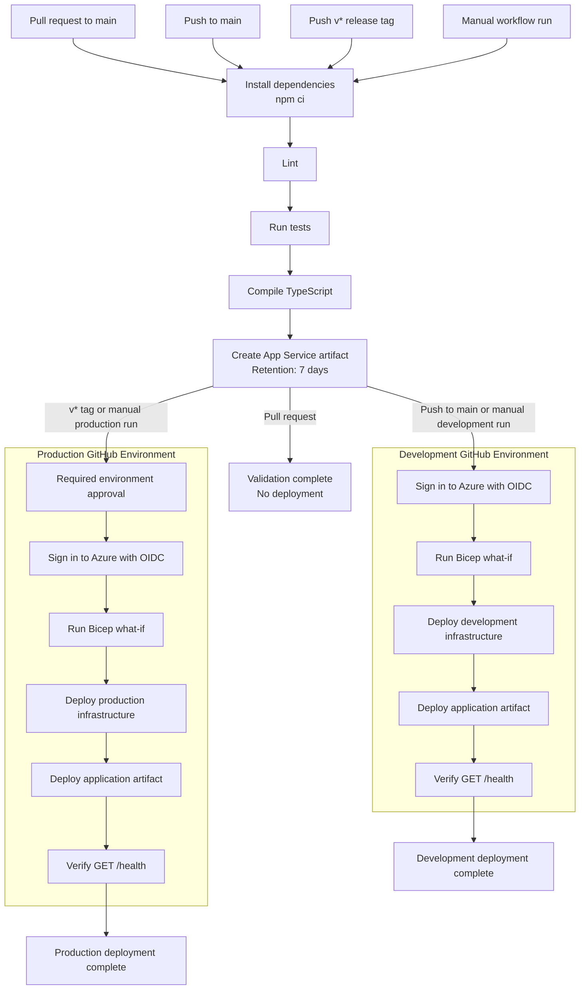

# CI/CD Pipeline

This document describes the GitHub Actions pipeline that validates and deploys
Agent Tjhelete to Azure App Service. The workflow is defined in
[`deploy.yml`](../.github/workflows/deploy.yml).

## Pipeline overview



## Trigger policy

| Trigger                | Outcome                                                            |
| ---------------------- | ------------------------------------------------------------------ |
| Pull request to `main` | Run linting, tests, compilation, and packaging without deploying.  |
| Push to `main`         | Deploy to the `development` GitHub Environment.                    |
| Push a `v*` tag        | Deploy the tagged revision to the `production` GitHub Environment. |
| Manual workflow run    | Select either development or production.                           |

## Continuous integration gate

Every workflow run must complete these stages successfully:

1. Check out the repository.
2. Configure the Node.js version declared in `.nvmrc`.
3. Restore dependencies with `npm ci`.
4. Run ESLint.
5. Run all configured workspace tests.
6. Compile every TypeScript workspace.
7. Remove development-only dependencies.
8. Package the API and its runtime dependencies into an App Service ZIP.
9. Upload the ZIP as a GitHub Actions artifact with seven-day retention.

Any failure stops the workflow before deployment.

## Development deployment

Development deploys automatically after a successful push to `main`. It can
also be selected from a manual workflow run.

The deployment:

1. Authenticates to Azure using the development environment's OIDC identity.
2. previews the Bicep changes with `az deployment sub what-if`;
3. deploys `infrastructure/parameters/dev.bicepparam`;
4. reads the App Service name and hostname from the Bicep outputs;
5. deploys the tested application artifact; and
6. retries `GET /health` until the service is healthy or the job times out.

Only one development deployment runs at a time. A newer run cancels a
superseded development deployment.

## Production deployment

Production deploys when a `v*` tag is pushed or production is selected manually.
Protect the `production` GitHub Environment with required reviewers so the
deployment pauses for approval.

The production job follows the same infrastructure preview, deployment,
application deployment, and health-check sequence as development, using
`infrastructure/parameters/prod.bicepparam`.

Production deployments are serialized and are not cancelled by newer runs. The
application artifact is immutable within one workflow run. A later tag run
rebuilds the artifact from the tagged commit rather than reusing an artifact
from an earlier development run.

## GitHub Environment configuration

Create GitHub Environments named `development` and `production`. Define these
variables in both environments:

| Variable                | Purpose                                               |
| ----------------------- | ----------------------------------------------------- |
| `AZURE_CLIENT_ID`       | Client ID of the environment-specific Azure identity. |
| `AZURE_TENANT_ID`       | Microsoft Entra tenant ID.                            |
| `AZURE_SUBSCRIPTION_ID` | Target Azure subscription ID.                         |

Configure a federated identity credential for each environment. Its subject
must use this format:

```text
repo:<owner>/<repository>:environment:<environment>
```

No long-lived Azure client secret is required.

## Azure permissions

The deployment identity must be able to create subscription deployments,
resource groups, Azure resources, and the role assignments declared by the
Bicep templates.

Use `Contributor` plus `User Access Administrator` at the target subscription
scope, or an equivalent least-privilege custom role. Use separate identities
and subscriptions for development and production where possible.

## Failure handling

| Failure                        | Pipeline behavior                                   |
| ------------------------------ | --------------------------------------------------- |
| Lint, test, or build failure   | Packaging and deployment do not run.                |
| Azure authentication failure   | Infrastructure and application deployment stop.     |
| Bicep deployment failure       | The application artifact is not deployed.           |
| Application deployment failure | The job fails before health verification completes. |
| Health check failure           | The job fails after exhausting its retries.         |

Automatic rollback is not currently configured. Roll back by redeploying a
known-good version tag or manually running the workflow from a known-good
revision.

## Production release procedure

1. Merge an approved pull request into `main`.
2. Confirm the development deployment and `/health` check succeed.
3. Create a version tag, such as `v1.2.0`, from the approved commit.
4. Push the tag to GitHub.
5. Approve the protected production environment deployment.
6. Confirm the production deployment and `/health` check succeed.
