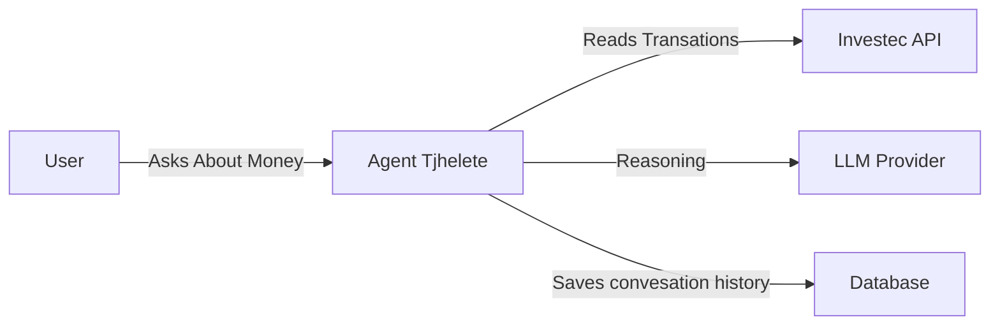
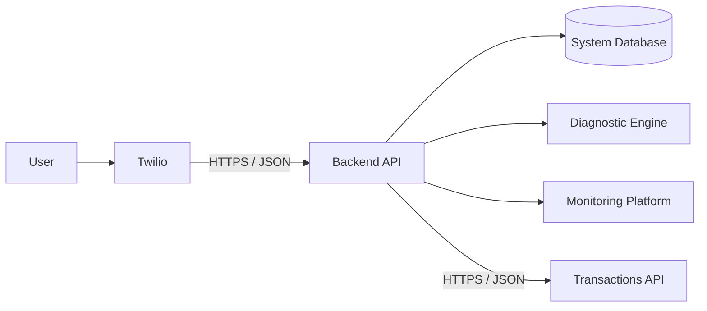

# System Overview

## 1 system Overview

A personal banker agent that will actively monitor your spenditure and help keep track of financial goals. Communication with the agent will be done over whatapp and it will use transation history and statements to track the money. The agent can schedule reports daily, weekly and monthly, it will also alert the user when they are going beyond their daily spend allowance.

## 2 Container Architecture

### 2.1 Twilio

### 2.2 Backend API

