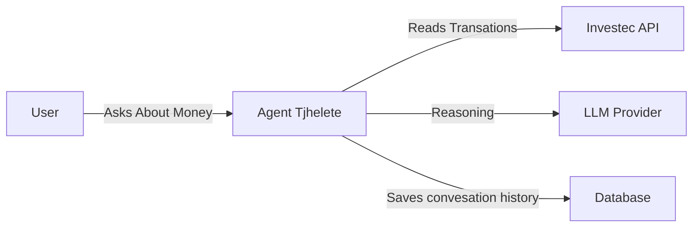
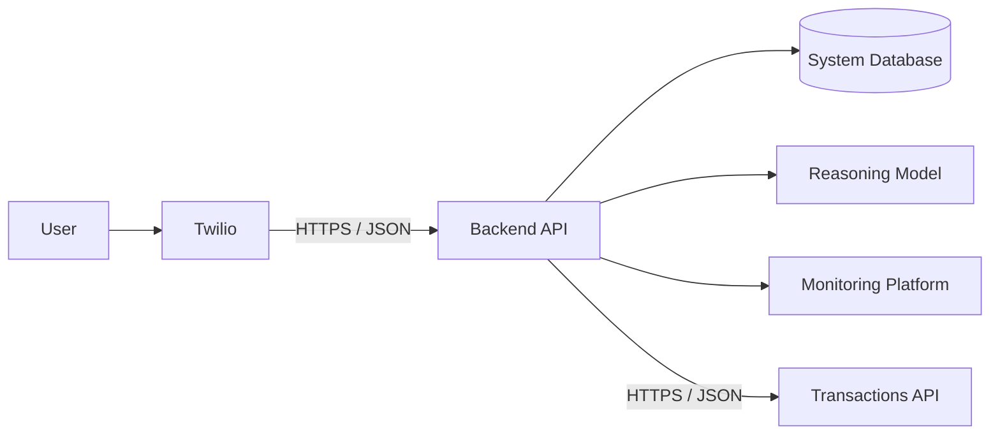
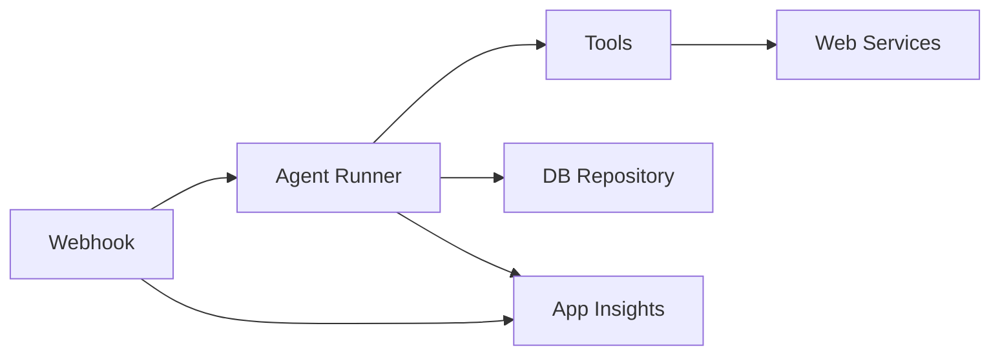

# System Overview

## 1 system Overview

A personal banker agent that will actively monitor your spenditure and help keep track of financial goals. Communication with the agent will be done over whatapp and it will use transation history and statements to track the money. The agent can schedule reports daily, weekly and monthly, it will also alert the user when they are going beyond their daily spend allowance.

## 2 Container Architecture

### 2.1 Twilio

It provides a simple api and a sandbox to use for communicating over whatsapp. It just faster and easier to integrate with their API over meta API. It costs more than using meta API and you dont get new whatsapp features as fast as in the meta API but given the use case the cost are relatively low and lasted features on whatsapp are not impactful to the core requirement of the system.

**Assumption:** the customer initiates the conversation and all replies are free-form messages sent within WhatsApp's 24-hour customer-service window. Estimates exclude VAT, foreign-exchange charges, optional products, and application/agent costs.

| Daily traffic pattern | Approx. messages/month | Meta Cloud API directly | Twilio Programmable Messaging | Difference |
| --- | ---: | ---: | ---: | ---: |
| 10 total messages/day (combined customer and agent messages) | 300 | $0.00 | $1.50 | $1.50/month more with Twilio |
| 10 messages in each direction/day | 600 | $0.00 | $3.00 | $3.00/month more with Twilio |

| Item | Meta Cloud API directly | Twilio |
| --- | ---: | ---: |
| Meta free-form message fee within the 24-hour service window | $0.00 | $0.00 |
| Platform fee per inbound or outbound message | $0.00 | $0.005 |
| 300 messages/month | $0.00 | 300 x $0.005 = $1.50 |
| 600 messages/month | $0.00 | 600 x $0.005 = $3.00 |

### 2.2 Backend API

The Backend API will be an express api that will also run the orchestration between the LLM for reasoning, the database for sesssion and memory management and the bank api. It will have a timed background job that will query the transactions and memomries to decide if it should alert the user on their behaviour.

### 2.3 System Database(Cosmos DB)

A no document database that will cost little considering the expected usauge. Database to store agent sessions, conversation history, memories, goals, transaction snapshots, schedules, and audit events as JSON documents.

### 2.4 LLM (Open AI)

This is the reasoning and intelligence component of the agent.

### 2.5 Application Insights

This will be were both application and agent logs are stored

### 2.6 Transactions API

For the first version this will be the Investec API.

## 3 Component Architecture

### 3.1 Web Components Structure

### 3.1 API Controller

## Sources

- [Twilio WhatsApp Messaging Pricing](https://www.twilio.com/en-us/whatsapp/pricing?locale=en) — $0.005 Twilio fee for each inbound and outbound message; Meta template fees; no Meta fee for free-form messages during the customer-service window.
- [Twilio: WhatsApp pricing change notice](https://help.twilio.com/hc/en-us/articles/30304057900699-Notice-Changes-to-WhatsApp-s-Pricing-April-2025) — service conversations/free-form messages are free from Meta when a customer-service window is open; Twilio per-message costs still apply.
- [Twilio Pricing](https://www.twilio.com/en-us/pricing) — Conversations API starts at $0.05 per active user per month.
- [Meta WhatsApp Business Platform pricing](https://developers.facebook.com/docs/whatsapp/pricing/) — direct-API template pricing and regional rate cards.
- [OpenAI API model pricing](https://developers.openai.com/api/docs/models)
- [Anthropic Claude API pricing](https://platform.claude.com/docs/en/about-claude/pricing)