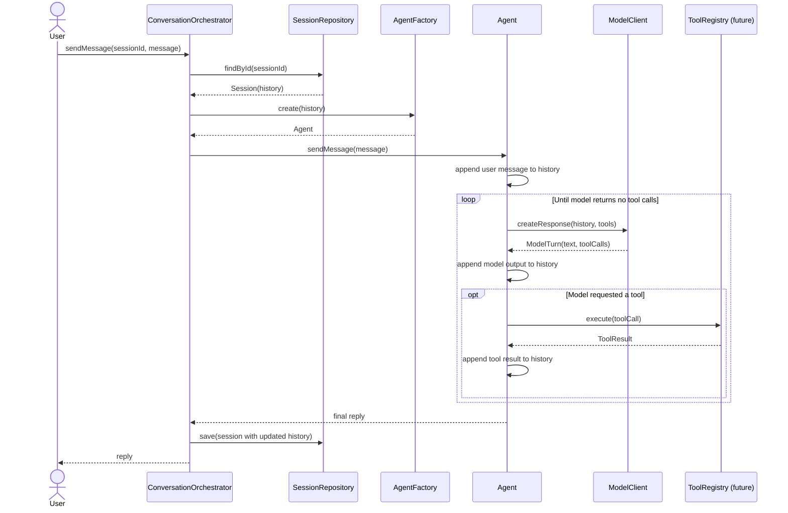
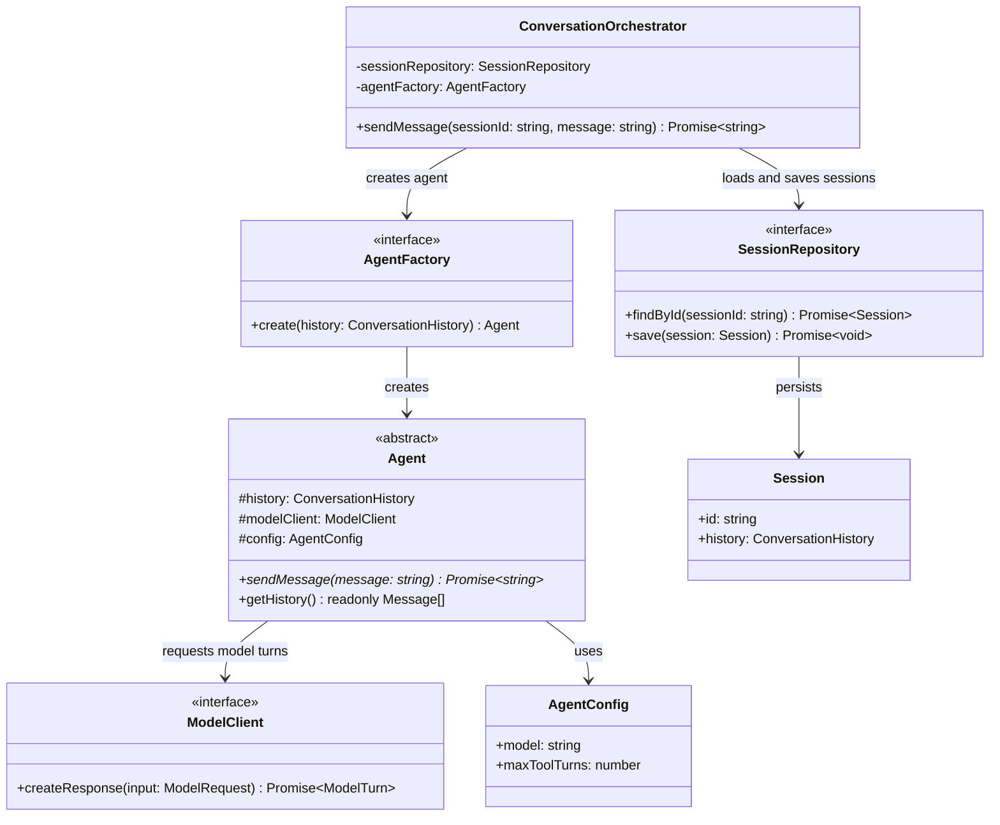

# Agent Conversation Loop Design

This document records the initial design for a stateful, tool-using conversation agent. It deliberately leaves the concrete tool registry and individual tools undefined; those are a later design decision.

## Design intent

One inbound user message is handled as a unit of work:

1. Load the existing session and its conversation history.
2. Construct an `Agent` with that history and its model dependencies.
3. Let the agent run its model/tool loop until it produces a final reply. If the
   tool-turn budget is exhausted, give the model a controlled failure result and
   request one final response with tools disabled.
4. Save the agent's updated history.
5. Return the reply to the caller.

The `ConversationOrchestrator` owns the session lifecycle. The `Agent` owns the in-memory conversation and the loop. A `ModelClient` hides provider-specific API details from the agent. Expected tool failures are conversation outcomes rather than exceptions, allowing the model to explain the failure or choose another available tool.

## Entity responsibilities and relationships

| Entity | Responsibility | Collaborates with |
| --- | --- | --- |
| `ConversationOrchestrator` | Coordinates one inbound message from session retrieval through persistence. It does not run tools or call the model itself. | `SessionRepository`, `AgentFactory`, `Agent` |
| `SessionRepository` | A database-module repository adapter that reads and writes a session, including its conversation history. The application depends on its contract, not its database implementation. | Database, `ConversationOrchestrator` |
| `AgentFactory` | Creates a fully configured, task-scoped `Agent`. This keeps construction details out of the orchestrator. | `Agent`, `ModelClient`, future `ToolRegistry` |
| `Agent` | Keeps the conversation history in memory; appends messages; repeats model calls and tool execution until a final reply is available. | `ModelClient`, future `ToolRegistry` |
| `ModelClient` | A provider adapter. It translates application history and tool definitions to a provider request and translates the provider response back to application types. | `Agent`, model provider |
| `ToolRegistry` | Deferred. It will define the approved tools, validate tool arguments, route requests to the correct handler, and return results. | `Agent`, application services |

## Module ownership

`SessionRepository` belongs to the **database module**. It extends the shared `IRepository` persistence contract described in [Database Module Design](database-design.md). Its concrete implementation is responsible for mapping between the database's session document and the application `Session` type. The conversation/application module defines the repository contract it needs and receives an implementation through dependency injection.

This keeps database SDKs, queries, and persistence mapping out of the orchestrator and agent loop.

## Message sequence



## Class sketches



```ts
export interface AgentFactory {
  create(history: ConversationHistory): Agent;
}

export interface ModelClient {
  createResponse(input: ModelRequest): Promise<ModelTurn>;
}

export interface SessionRepository extends IRepository<Session> {}

export abstract class Agent {
  protected readonly history: ConversationHistory;

  public constructor(
    existingHistory: ConversationHistory,
    protected readonly modelClient: ModelClient,
    protected readonly config: AgentConfig,
  ) {
    this.history = [...existingHistory];
  }

  public abstract sendMessage(message: string): Promise<string>;

  public getHistory(): readonly Message[] {
    return this.history;
  }
}

export class ConversationOrchestrator {
  public constructor(
    private readonly sessionRepository: SessionRepository,
    private readonly agentFactory: AgentFactory,
  ) {}

  public async sendMessage(
    sessionId: string,
    message: string,
  ): Promise<string> {
    throw new Error("Not implemented");
  }
}
```

## Dependency direction

Dependencies point inward toward stable application contracts:

```text
ConversationOrchestrator -> SessionRepository contract, AgentFactory
Agent                    -> ModelClient, future ToolRegistry
OpenAIModelClient        -> OpenAI SDK
DatabaseSessionRepository -> Database SDK
```

This lets tests replace `ModelClient` and `SessionRepository` with fakes, without changing the agent loop or orchestration logic.

## Tool registry design

The agent loop receives a `ToolRegistry` that exposes model-visible tool definitions and safely executes only known tool calls. The detailed design is recorded in [Tool Registry Design](tool-registry-design.md). Tool implementations remain outside `Agent`, keeping the loop independent of banking, reporting, or other domain operations.
