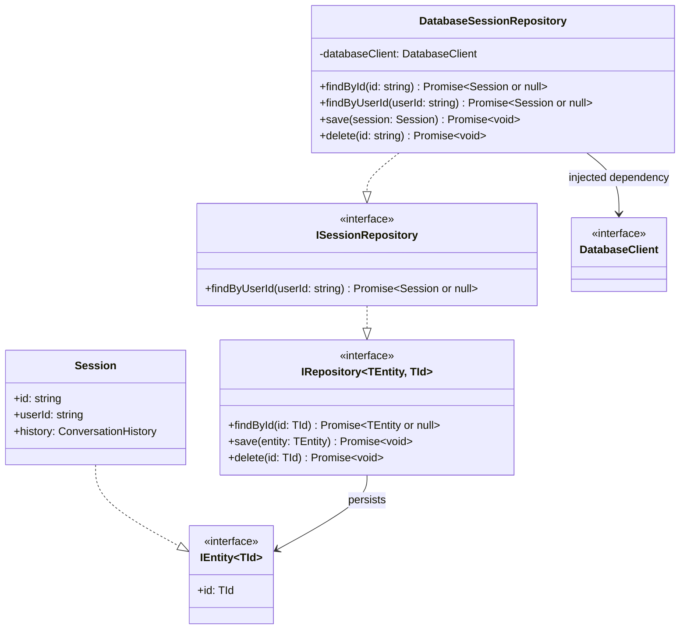
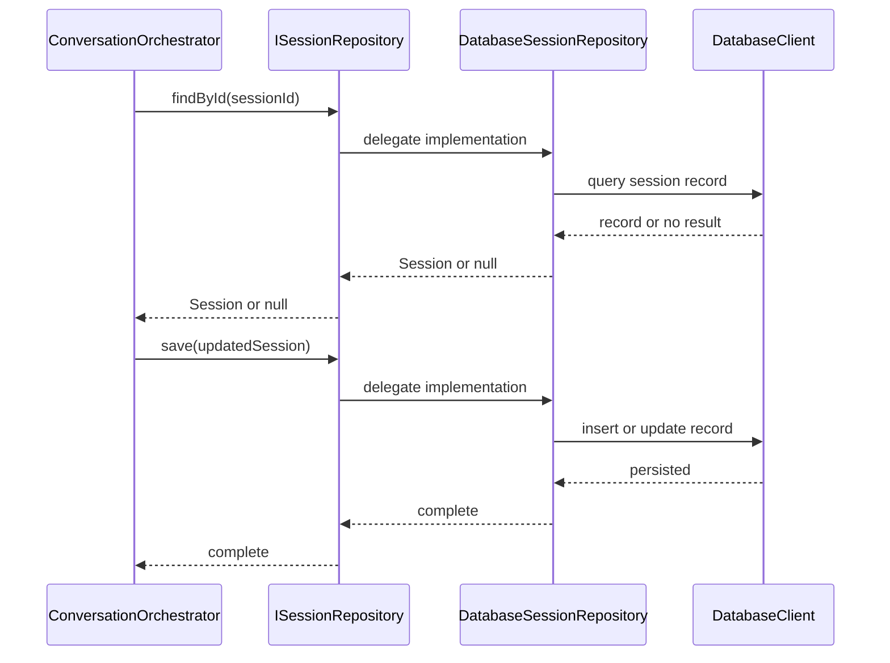

# Database Module Design

This document records the initial design for the database/repository module. It is a design document only; no persistence implementation is included.

## Design intent

The database module owns persistence details: database connections, queries, document/row mapping, and concrete repository implementations.

The rest of the application depends on repository contracts, not on a database SDK or query language. It asks repositories to load, save, or remove application entities.

## Core repository contract

All persisted entities have an identifier. The shared `IRepository` provides only the common persistence operations.

```ts
export interface IEntity<TId = string> {
  id: TId;
}

export interface IRepository<TEntity extends IEntity<TId>, TId = string> {
  findById(id: TId): Promise<TEntity | null>;
  save(entity: TEntity): Promise<void>;
  delete(id: TId): Promise<void>;
}
```

`save` creates or updates the entity. The database implementation chooses whether that is an insert, update, upsert, or equivalent operation.

`findById` returns `null` when no entity exists. A missing record is normal application state, not a database error.

`delete` is included because the product supports user data-deletion requests. The exact deletion workflow and retention policy remain deferred.

## Focused repositories

`IRepository` is a base contract, not a requirement to force every query through a generic API. A repository may add methods that represent a genuine application need.

The first expected repository is session storage:

```ts
export interface Session extends IEntity {
  userId: string;
  history: ConversationHistory;
}

export interface ISessionRepository extends IRepository<Session> {
  findByUserId(userId: string): Promise<Session | null>;
}
```

The conversation orchestrator loads a session, sends the message through the agent, then saves the updated session.

Future entities follow the same pattern only when persistence is needed:

```ts
export interface BudgetRepository extends IRepository<Budget> {
  findByUserId(userId: string): Promise<Budget | null>;
}

export interface GoalRepository extends IRepository<Goal> {
  listByUserId(userId: string): Promise<readonly Goal[]>;
}
```

## Entity responsibilities and relationships

| Entity | Responsibility | Collaborates with |
| --- | --- | --- |
| `IEntity` | Defines the identifier required by persisted entities. | `IRepository`, application entities |
| `IRepository` | Defines common load, save, and delete operations. | Application services, concrete repositories |
| `ISessionRepository` | Adds the session lookup the conversation workflow needs. | `ConversationOrchestrator`, concrete session repository |
| `DatabaseSessionRepository` | Maps database records to and from `Session`, and executes database operations. | Database client, `ISessionRepository` |
| Database client | Owns the database SDK connection and raw query operations. | Concrete repositories |

## Class diagram



## Message sequence



## Module ownership

The repository contracts belong with the application concepts that use them. Concrete database implementations belong in `tjabane-agent-tjhelete-repository`.

```text
Application / agent module -> IRepository and ISessionRepository contracts
Database repository module -> concrete DatabaseSessionRepository -> database SDK
API composition root        -> creates concrete repository and injects it
```

This direction keeps database SDK types, raw queries, and persistence record shapes out of the agent and application logic.

## Proposed module layout

```text
tjabane-agent-tjhelete-repository/
└── src/
    ├── database-client.ts
    ├── database-session-repository.ts
    ├── mappers/
    │   └── session-record-mapper.ts
    └── index.ts
```

The repository module does not need a separate generic abstraction layer beyond `IRepository`. Database record DTOs and mapping functions stay inside this module, just as bank-provider DTOs stay inside the services module.

## Decisions

- Use `IRepository<TEntity, TId>` for shared persistence operations.
- Use `findById`, `save`, and `delete` as the initial common operations.
- Add domain-specific methods, such as `findByUserId`, on focused repositories rather than overloading a generic repository with query flags.
- Keep concrete database repositories and database SDK usage in the repository module.
- Inject concrete repositories from the API/application composition root.
- Map database records to application entities at the repository boundary.

## Deferred decisions

- Database technology, connection configuration, migrations, and indexes.
- The database record shape and mapping for each entity.
- Transaction support, optimistic locking, and concurrent session updates.
- Exact data-retention and deletion policy.
- Which future financial entities need their own repositories.
