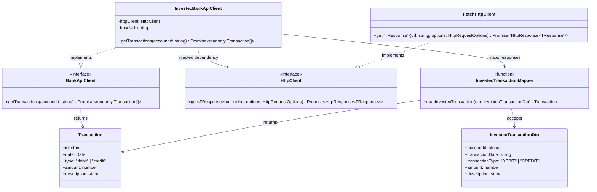
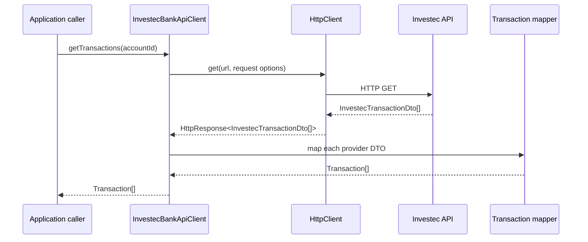

# Services Module Design

This document records the initial design for the services module. The module provides infrastructure adapters for external systems, beginning with the Investec banking API. It deliberately describes design only; it does not implement the client.

## Design intent

The services module owns the details of talking to external HTTP APIs:

1. Send a request through a reusable HTTP client.
2. Receive and validate the provider's response shape.
3. Translate provider-specific DTOs into clean application data.
4. Return that clean data to the caller.

The rest of the application should work with a `Transaction` and should not need to know that a transaction originated from Investec, what Investec calls a field, or how its HTTP API is structured.

## Entity responsibilities and relationships

| Entity | Responsibility | Collaborates with |
| --- | --- | --- |
| `HttpClient` | Defines the small HTTP capability required by service clients. It is independent of a specific HTTP library. | `FetchHttpClient`, service clients |
| `FetchHttpClient` | Implements `HttpClient` using the platform `fetch` API. It owns generic request execution and HTTP failure handling. | `fetch` |
| `BankApiClient` | Defines the banking data capability required by the application. It does not expose provider DTOs. | `InvestecBankApiClient` |
| `InvestecBankApiClient` | Calls Investec endpoints, receives Investec DTOs, and returns application transaction data. It receives its dependencies through its constructor. | `HttpClient`, `InvestecTransactionDto`, transaction mapper |
| `InvestecTransactionDto` | Represents the response shape supplied by Investec. This is a provider detail and stays inside the Investec area of the services module. | `InvestecBankApiClient`, transaction mapper |
| `Transaction` | Represents the clean transaction data supplied to the rest of the application. | `BankApiClient`, callers outside services |
| `mapInvestecTransaction` | Converts an `InvestecTransactionDto` into a `Transaction`. It is the boundary that prevents provider naming and formats leaking outward. | `InvestecTransactionDto`, `Transaction` |

## Proposed module layout

```text
tjabane-agent-tjhelete-services/
└── src/
    ├── http/
    │   ├── http-client.ts
    │   └── fetch-http-client.ts
    ├── investec/
    │   ├── investec-bank-api-client.ts
    │   ├── dtos/
    │   │   └── investec-transaction.dto.ts
    │   └── mappers/
    │       └── investec-transaction-mapper.ts
    ├── banking/
    │   ├── bank-api-client.ts
    │   └── transaction.ts
    └── index.ts
```

This is one module, not a new shared `libraries` module. The generic HTTP pieces are kept separate from Investec-specific code so they can be extracted later if they become truly shared. No such extraction is needed initially.

## Public contracts

The rest of the application consumes a provider-neutral banking contract:

```ts
export interface BankApiClient {
  getTransactions(accountId: string): Promise<readonly Transaction[]>;
}

export interface Transaction {
  id: string;
  date: Date;
  type: "debit" | "credit";
  amount: number;
  description: string;
}
```

The initial HTTP contract is deliberately small. It may grow only when a real service client needs another operation.

```ts
export interface HttpClient {
  get<TResponse>(
    url: string,
    options?: HttpRequestOptions,
  ): Promise<HttpResponse<TResponse>>;
}

export interface HttpRequestOptions {
  headers?: Readonly<Record<string, string>>;
}

export interface HttpResponse<TBody> {
  status: number;
  body: TBody;
  headers: Readonly<Record<string, string>>;
}
```

## Investec client construction

`InvestecBankApiClient` does not read environment variables or create HTTP clients itself. Its dependencies are visible in its constructor:

```ts
export class InvestecBankApiClient implements BankApiClient {
  public constructor(
    private readonly httpClient: HttpClient,
    private readonly baseUrl: string,
  ) {}

  public async getTransactions(
    accountId: string,
  ): Promise<readonly Transaction[]> {
    throw new Error("Not implemented");
  }
}
```

The application composition root owns configuration and wiring:

```ts
const httpClient = new FetchHttpClient();
const bankApiClient = new InvestecBankApiClient(
  httpClient,
  config.investecBaseUrl,
);
```

Authentication will also be injected rather than read directly by the client. Its exact form is deferred until the Investec API authentication flow is confirmed.

## Class diagram



## Provider DTO and mapping boundary

An external provider's response is not the application's model:

```ts
interface InvestecTransactionDto {
  accountId: string;
  transactionDate: string;
  transactionType: "DEBIT" | "CREDIT";
  amount: number;
  description: string;
}
```

The mapper translates it at the boundary:

```ts
export function mapInvestecTransaction(
  dto: InvestecTransactionDto,
): Transaction {
  return {
    id: `${dto.accountId}-${dto.transactionDate}-${dto.description}`,
    date: new Date(dto.transactionDate),
    type: dto.transactionType === "DEBIT" ? "debit" : "credit",
    amount: dto.amount,
    description: dto.description,
  };
}
```

The mapper may initially live beside `InvestecBankApiClient` and move into `mappers/` only when it becomes substantial or is reused. The design boundary matters; a separate file is optional.

## Message sequence



## Dependency direction

```text
Application / agent module -> BankApiClient contract
InvestecBankApiClient      -> BankApiClient, HttpClient
FetchHttpClient            -> platform fetch API
Investec DTO + mapper      -> services module only
```

The agent must not depend on `InvestecBankApiClient`, `HttpClient`, provider DTOs, URLs, or credentials. It will receive a banking capability later through the application composition root.

## Design decisions

- Keep HTTP infrastructure in the services module for now; do not create a libraries module prematurely.
- Inject `HttpClient` and `baseUrl` into `InvestecBankApiClient`.
- Keep raw Investec DTOs internal to the services module.
- Map external DTOs to a provider-neutral `Transaction` before returning data.
- Keep abstractions small and introduce new HTTP operations only when needed.
- Keep configuration and credential construction at the composition root, not inside service clients.

## Deferred decisions

- Exact Investec endpoint paths, response DTOs, pagination, and authentication mechanism.
- Account and balance contracts.
- Error types and retry/rate-limit policy.
- Transaction categorisation and persistence; these belong outside the raw bank API client.
- How the agent tool layer will consume banking capabilities.
