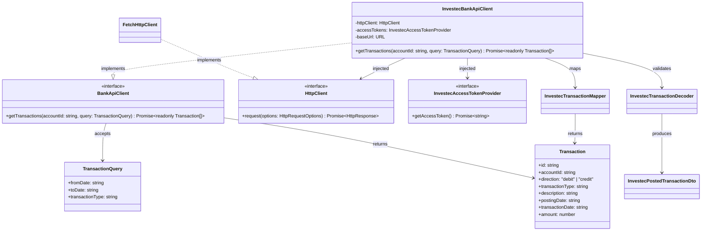
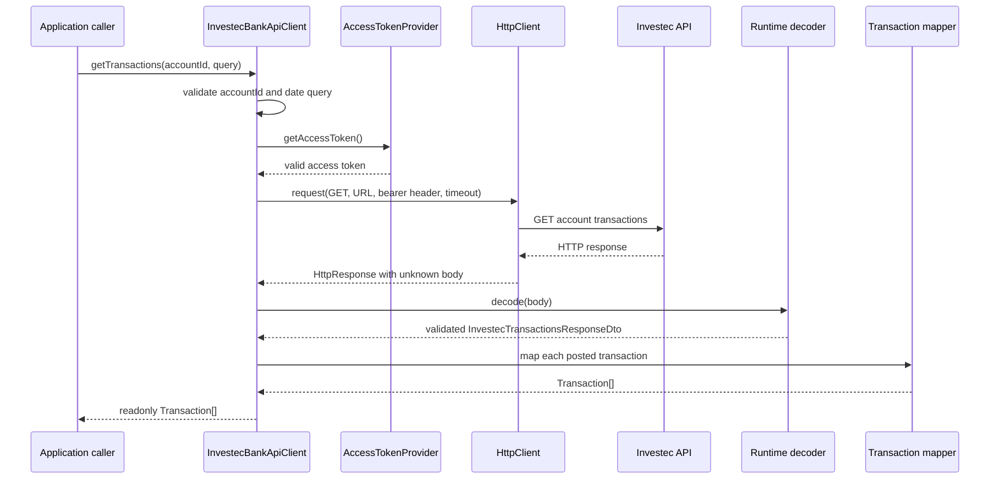

# Services Module Design

This document defines the initial services-module design. The module contains
provider-neutral service contracts and infrastructure adapters for external
systems, beginning with the Investec Private Bank API. It deliberately describes
design only; it does not implement the client.

The initial banking scope is limited to retrieving posted transactions. Account
balances, pending transactions, payments, transfers, and other Investec
capabilities are outside this first design.

## Design intent

The services module owns the details of communicating with external HTTP APIs:

1. Send requests through a reusable HTTP client.
2. Treat every external response as untrusted data.
3. Validate provider responses at runtime.
4. Translate valid provider DTOs into provider-neutral service data.
5. Return provider-neutral results or explicit failures.

The rest of the application works with `BankApiClient`, `TransactionQuery`, and
`Transaction`. It does not know how Investec names fields, structures response
envelopes, authenticates requests, or constructs endpoint URLs.

## Ownership and dependency direction

Provider-neutral banking contracts belong to the `banking` capability in the
services module. The services package is the workspace's application-services
boundary; it owns the public banking capability and the external adapters that
implement it. Keeping banking contracts out of the agent module allows the agent
to remain focused on model orchestration.

Provider-specific implementations remain nested beneath their capability and
are not part of the provider-neutral contract. `HttpClient` is shared
infrastructure used by service adapters and also belongs to the services module.

```text
Services module
  -> owns BankApiClient, TransactionQuery, and Transaction
  -> owns InvestecBankApiClient, Investec DTOs, validation, and mapping
  -> owns HttpClient and FetchHttpClient

Application / tools modules
  -> depend on the provider-neutral BankApiClient contract
  -> do not depend on Investec or HTTP details

API composition root
  -> constructs the concrete HTTP, authentication, and Investec adapters
  -> injects BankApiClient into its consumers
```

The agent and tool layers must not depend on `InvestecBankApiClient`,
`HttpClient`, provider DTOs, endpoint URLs, access tokens, API keys, or client
credentials.

## Confirmed Investec API contract

The initial adapter targets the South African Private Bank v1 account
transactions endpoint:

```http
GET /za/pb/v1/accounts/{accountId}/transactions
```

The current API reference documents:

- A required `accountId` path parameter with a maximum length of 30.
- Optional `fromDate` and `toDate` query parameters in `YYYY-MM-DD` format.
- An optional free-form `transactionType` filter.
- An optional `includePending` flag.
- Filtering by `postingDate`.
- A default `fromDate` of today minus 180 days and a default `toDate` of today.
- Response codes 200, 400, 401, 403, 429, and 500.

The client always sends explicit `fromDate` and `toDate` values. This avoids
depending on provider defaults, which have changed across published Investec
documentation.

Although the current API supports `includePending` and also has a dedicated
pending-transactions endpoint, the initial service contract returns posted
transactions only. Pending responses have a smaller field set and require a
separate domain decision.

## Entity responsibilities

| Entity                              | Owner             | Responsibility                                                                    |
| ----------------------------------- | ----------------- | --------------------------------------------------------------------------------- |
| `BankApiClient`                     | Services/Banking  | Defines the provider-neutral posted-transaction capability.                       |
| `TransactionQuery`                  | Services/Banking  | Defines the required calendar-date range and optional transaction-type filter.    |
| `Transaction`                       | Services/Banking  | Represents one validated, provider-neutral posted transaction.                    |
| `HttpClient`                        | Services/HTTP     | Defines the HTTP capability required by service adapters.                         |
| `FetchHttpClient`                   | Services/HTTP     | Executes requests with platform `fetch` and applies shared HTTP failure rules.    |
| `InvestecAccessTokenProvider`       | Services/Investec | Supplies valid access tokens and hides token acquisition and caching.             |
| `InvestecBankApiClient`             | Services/Investec | Calls the Investec endpoint and implements `BankApiClient`.                       |
| `decodeInvestecTransactionResponse` | Services/Investec | Validates an untrusted response envelope and its posted transactions.             |
| `mapInvestecTransaction`            | Services/Investec | Maps a validated Investec transaction DTO into an application-facing transaction. |

## Proposed module layout

Provider-neutral contracts live at the root of the services capability that
owns them. Provider implementation details are nested beneath that root:

```text
tjabane-agent-tjhelete-services/
`-- src/
    |-- banking/
    |   |-- bank-api-client.interface.ts
    |   |-- transaction.interface.ts
    |   |-- transaction-query.interface.ts
    |   `-- investec/
    |       |-- auth/
    |       |   |-- default-investec-access-token-provider.ts
    |       |   `-- investec-access-token-provider.interface.ts
    |       |-- clients/
    |       |   `-- investec-bank-api-client.ts
    |       |-- decoders/
    |       |   `-- investec-transaction.decoder.ts
    |       |-- dtos/
    |       |   `-- investec-transaction.dto.ts
    |       |-- errors/
    |       |   `-- provider-response-validation-error.ts
    |       `-- mappers/
    |           `-- investec-transaction-mapper.ts
    |-- http/
    |   |-- fetch-http-client.ts
    |   |-- http-client.interface.ts
    |   `-- http-error.ts
    `-- index.ts
```

Files that define interfaces use the `.interface.ts` suffix. Investec files are
grouped by technical role because authentication, client execution, decoding,
DTOs, errors, and mapping now form distinct provider concerns. These folders
remain inside `banking/investec`, preserving the provider boundary.

Speculative capabilities such as email are not included before a concrete
application requirement and provider contract exist.

## Provider-neutral banking contracts

```ts
export interface BankApiClient {
  getTransactions(accountId: string, query: TransactionQuery): Promise<readonly Transaction[]>;
}

export interface TransactionQuery {
  readonly fromDate: string;
  readonly toDate: string;
  readonly transactionType?: string;
}

export interface Transaction {
  readonly id: string;
  readonly accountId: string;
  readonly direction: "debit" | "credit";
  readonly transactionType: string;
  readonly description: string;
  readonly postingDate: string;
  readonly transactionDate: string;
  readonly amount: number;
}
```

### Contract invariants

- `accountId` is non-empty and no longer than 30 characters.
- `fromDate` and `toDate` are real calendar dates in strict `YYYY-MM-DD` format.
- `fromDate` is not after `toDate`.
- The client always sends both dates to Investec.
- The date range maps directly to Investec's `postingDate` filter. The
  documentation does not define whether its boundaries are inclusive, so the
  client must not invent half-open-range semantics.
- `postingDate` is the date on which the transaction affects the account
  balance.
- `transactionDate` is the date on which the transaction occurred.
- Both transaction dates remain validated date-only strings. They are not
  converted into JavaScript `Date` objects because Investec supplies no time or
  timezone.
- `id` maps directly to Investec's `uuid` field. The client does not synthesise
  an identifier from mutable transaction fields. Investec does not document
  cross-request stability guarantees, so that behavior must be verified before
  the value is used for persistent deduplication.
- `direction` is mapped from Investec's `DEBIT` or `CREDIT` value.
- `transactionType` is treated as a provider-supplied string rather than a
  closed enum because the API does not publish a complete fixed value set.
- The contract returns posted transactions only.
- The service does not promise result ordering because the provider contract
  does not document one. Consumers that require ordering must apply it
  explicitly.

## Amount and currency boundary

The transaction endpoint returns `amount` as a JSON number but does not include
a currency. Currency is available from other account endpoints, including the
account-balance endpoint.

The initial `Transaction` therefore preserves `amount` as a finite number and
does not claim to expose a complete `Money` value. Consumers must not assume a
currency merely because the initial provider is in South Africa.

The decoder rejects non-finite values. Aggregation code must account for
JavaScript floating-point behavior. A future account/balance design must decide
how currency is obtained and whether amounts are normalised to decimal strings
or integer minor units. A `Money` interface is deferred until that decision is
made.

## HTTP contract

The HTTP boundary returns `unknown` because TypeScript generic parameters do not
validate runtime JSON. Provider adapters own runtime decoding.

```ts
export interface HttpClient {
  request(options: HttpRequestOptions): Promise<HttpResponse>;
}

export interface HttpRequestOptions {
  readonly method: "GET" | "POST";
  readonly url: URL;
  readonly headers?: Readonly<Record<string, string>>;
  readonly body?: string;
  readonly timeoutMs?: number;
  readonly signal?: AbortSignal;
}

export interface HttpResponse {
  readonly status: number;
  readonly body: unknown;
  readonly headers: Readonly<Record<string, string>>;
}
```

`GET` supports transaction retrieval. `POST` supports OAuth token acquisition.
More HTTP methods are added only when an implemented adapter requires them.

### HTTP failure semantics

`FetchHttpClient` follows these rules:

- It returns `HttpResponse` only for 2xx responses.
- It throws `HttpStatusError` for non-2xx responses. The error exposes the
  status and safe retry metadata but does not expose credentials or raw
  sensitive bodies in its message.
- It throws `HttpNetworkError` when no HTTP response is received.
- It throws `HttpTimeoutError` when `timeoutMs` expires.
- It distinguishes caller cancellation from a timeout.
- It throws `HttpBodyParseError` when a response declared as JSON cannot be
  parsed. A successful empty response has a `null` body.
- It does not retry automatically.
- A 429 response is an `HttpStatusError`. The current Investec documentation
  confirms 429 responses but does not publish a rate threshold or guarantee a
  `Retry-After` header.

Provider validation failures are not HTTP failures.
`InvestecBankApiClient` throws `ProviderResponseValidationError` when a 2xx body
does not match the confirmed Investec response structure. Validation errors
identify invalid fields for diagnostics without logging transaction contents.

## Investec authentication

Investec uses the OAuth 2.0 client-credentials grant with an additional
`x-api-key` header:

```http
POST /identity/v2/oauth2/token
Authorization: Basic base64(client_id:client_secret)
x-api-key: <api key>
Content-Type: application/x-www-form-urlencoded

grant_type=client_credentials
```

The documented success response is:

```ts
interface InvestecAccessTokenDto {
  readonly access_token: string;
  readonly token_type: "Bearer";
  readonly expires_in: number;
  readonly scope: string;
}
```

Documented tokens are valid for approximately 30 minutes. The API does not
document a refresh token. The token provider caches the access token, observes
`expires_in` with a safety margin, coordinates concurrent acquisition, and
requests a new token through client credentials when needed.

`InvestecBankApiClient` does not read environment variables, create HTTP
clients, or manage credentials:

```ts
export class InvestecBankApiClient implements BankApiClient {
  public constructor(
    private readonly httpClient: HttpClient,
    private readonly accessTokens: InvestecAccessTokenProvider,
    private readonly baseUrl: URL,
  ) {}

  public async getTransactions(
    accountId: string,
    query: TransactionQuery,
  ): Promise<readonly Transaction[]> {
    throw new Error("Not implemented");
  }
}

export interface InvestecAccessTokenProvider {
  getAccessToken(): Promise<string>;
}
```

The API composition root supplies configuration and wiring:

```ts
const httpClient = new FetchHttpClient();
const accessTokens = new DefaultInvestecAccessTokenProvider(
  httpClient,
  config.investecTokenUrl,
  config.investecClientId,
  config.investecClientSecret,
  config.investecApiKey,
);
const bankApiClient: BankApiClient = new InvestecBankApiClient(
  httpClient,
  accessTokens,
  config.investecBaseUrl,
);
```

Secrets and access tokens must not appear in object inspection, exception
messages, application results, or telemetry.

## Provider DTO and validation boundary

The current documented posted-transaction response contains:

```ts
interface InvestecPostedTransactionDto {
  readonly accountId: string;
  readonly type: "DEBIT" | "CREDIT";
  readonly transactionType: string;
  readonly status: "POSTED";
  readonly description: string;
  readonly cardNumber: string;
  readonly postedOrder: number;
  readonly postingDate: string;
  readonly valueDate: string;
  readonly actionDate: string;
  readonly transactionDate: string;
  readonly amount: number;
  readonly runningBalance: number;
  readonly uuid: string;
}

interface InvestecTransactionsResponseDto {
  readonly data: {
    readonly transactions: readonly InvestecPostedTransactionDto[];
  };
  readonly links: {
    readonly self: string;
  };
  readonly meta: {
    readonly totalPages: number;
  };
}
```

The response crosses two distinct boundaries:

```text
unknown HTTP body
  -> runtime decoder
  -> validated InvestecTransactionsResponseDto
  -> provider mapper
  -> provider-neutral Transaction[]
```

`decodeInvestecTransactionResponse(body: unknown)` checks the response envelope
and every transaction. It rejects missing fields, unsupported debit/credit
values, non-posted records, malformed calendar dates, non-finite amounts, and
empty provider identifiers. Despite its field name, the documented `uuid`
example is an opaque numeric string, so the decoder must not require RFC UUID
syntax. A TypeScript assertion or generic type argument alone is not runtime
validation.

The mapper accepts only a validated DTO:

```ts
export function mapInvestecTransaction(dto: InvestecPostedTransactionDto): Transaction {
  return {
    id: dto.uuid,
    accountId: dto.accountId,
    direction: dto.type === "DEBIT" ? "debit" : "credit",
    transactionType: dto.transactionType,
    description: dto.description,
    postingDate: dto.postingDate,
    transactionDate: dto.transactionDate,
    amount: dto.amount,
  };
}
```

The decoder and mapper are separate provider-root files from the start. The
decoder establishes runtime trust; the mapper translates between two known
shapes.

## Pagination analysis

The current Private Bank OpenAPI contract does not document `page`, `limit`, or
`cursor` request parameters for the transactions endpoint. It returns a
`meta.totalPages` field, but it does not document how another page would be
requested.

Older Investec sources conflict: the Private Bank Postman collection says there
is no limit on returned results, while the community guide mentions a
pagination parameter while discussing Private Banking and CIB together. The
current official Private Bank API reference takes precedence.

The initial public contract therefore returns `readonly Transaction[]` and does
not introduce `TransactionPage`, a cursor, or a limit. The decoder still checks
`meta.totalPages`. If the API returns a value greater than one, the adapter must
fail explicitly rather than silently return incomplete history. Pagination is
added only after Investec documents a request mechanism or observed sandbox
behavior establishes one.

## Class diagram



## Message sequence



## Public and private exports

The services module publicly exports `BankApiClient`, `TransactionQuery`,
`Transaction`, `InvestecBankApiClient`, `FetchHttpClient`, and only the
configuration or authentication types required by the composition root.
Application and tool modules consume the provider-neutral banking contracts
through the services package public API.

Investec response DTOs, decoders, mappers, endpoint builders, token DTOs, and raw
error bodies remain private to the services package. The package root
`index.ts` must not re-export them.

## Design decisions

- Provider-neutral banking contracts live at the root of the services module's
  `banking` capability.
- The agent module does not own banking contracts.
- Keep the first public banking contract to `BankApiClient`,
  `TransactionQuery`, and `Transaction`.
- Provider adapters implement the service-owned capability contract.
- Files that define interfaces use the `.interface.ts` suffix.
- Organise provider-specific files into role-based folders inside the provider
  boundary.
- External response bodies remain `unknown` until runtime validation succeeds.
- Keep decoding and mapping as separate boundary operations.
- Always send explicit Investec `fromDate` and `toDate` filters.
- Preserve Investec calendar dates as validated date-only strings.
- Map the documented Investec `uuid` directly to transaction identity instead
  of synthesising an identifier.
- Return posted transactions only in the initial contract.
- Do not introduce application pagination until the provider documents a
  request mechanism.
- Preserve transaction amounts as finite numbers initially and defer a complete
  money model until account currency is available.
- Return HTTP responses only for 2xx statuses and use explicit failure types.
- Do not perform automatic HTTP retries.
- Inject `HttpClient`, `InvestecAccessTokenProvider`, and `baseUrl`.
- Keep configuration, credential construction, and concrete wiring at the
  composition root.
- Do not include speculative provider areas before their contracts are
  designed.

## Deferred decisions

- Account and balance contracts, including the source of transaction currency.
- Decimal or integer-minor-unit money representation after currency is known.
- Pending-transaction modeling and whether it should use a discriminated union.
- Verification that Investec `uuid` values remain stable across repeated
  requests and transaction-history changes.
- Pagination behavior if Investec documents or exposes a page request
  parameter.
- Provider-specific retry and rate-limit policy.
- Concrete runtime validation library or handwritten decoder implementation.
- Concrete application error translation above the services adapter.
- Transaction categorisation and persistence, which belong outside the raw bank
  adapter.
- How transaction query services are exposed to the agent tool layer.

## Sources

- [Investec Private Bank API reference](https://developer.investec.com/api-reference/SA%20PB%20Account%20Information)
  — current OpenAPI-based authentication, endpoint, query, response, release
  note, and error documentation.
- [Investec Programmable Banking Private Bank Postman collection](https://www.postman.com/investec-open-api/programmable-banking/documentation/gly7cw5/investec-programmable-banking-pb)
  — older request examples and transaction behavior.
- [Investec Developer Community transaction guide](https://investec.gitbook.io/programmable-banking-community-wiki/get-started/api-quick-start-guide/how-to-get-your-transaction-history)
  — supplementary date and pagination guidance covering both Private Banking
  and CIB.
