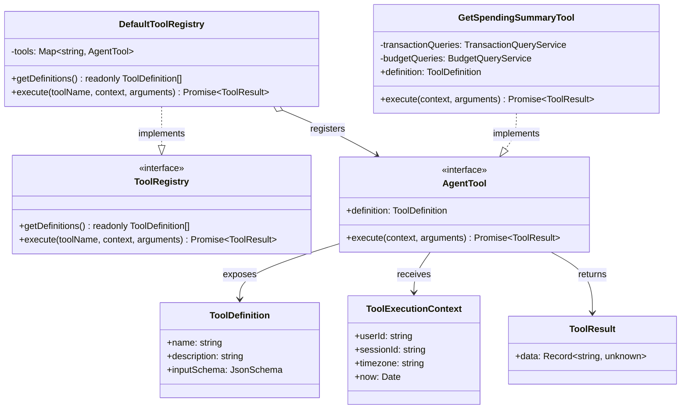
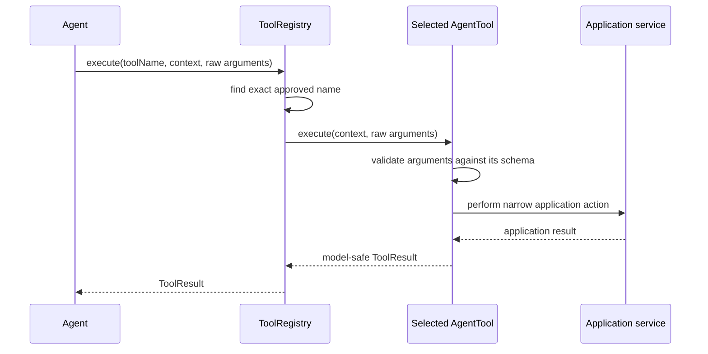

# Tool Registry Design

This document finalises the initial design of the agent tool registry. It is a design document only; no tool registry or tools are implemented here.

## Design intent

This registry is designed for the application's single configured user. It must not introduce multi-user credential resolution or tenancy abstractions. Investec credentials belong to the deployed application, and the accounts returned by Investec for its scoped API key are the complete authorised account set.

The `ToolRegistry` is the controlled boundary between a model's tool request and application capabilities. It has three responsibilities:

1. Provide the approved tool definitions to the model client.
2. Find a tool by its exact approved name.
3. Dispatch that tool with trusted execution context and untrusted model arguments.

The registry does not contain banking calculations, call bank APIs, or implement individual tools. A concrete tool owns its schema validation and calls its application dependencies.

## Core contracts

The tool-definition contract stays independent of a model provider. A `ModelClient` translates it to the SDK-specific function/tool format.

```ts
export interface ToolDefinition {
  name: string;
  description: string;
  inputSchema: JsonSchema;
}

export interface AgentTool {
  readonly definition: ToolDefinition;

  execute(context: ToolExecutionContext, arguments_: unknown): Promise<ToolResult>;
}

export interface ToolRegistry {
  getDefinitions(): readonly ToolDefinition[];
  execute(
    toolName: string,
    context: ToolExecutionContext,
    arguments_: unknown,
  ): Promise<ToolResult>;
}
```

`JsonSchema` represents the project’s chosen JSON Schema type. The exact library is deliberately deferred; the schema must be usable both to describe the model contract and validate the incoming arguments.

## Execution context

The model supplies only tool arguments. The application supplies the execution context after authenticating the inbound message.

```ts
export interface ToolExecutionContext {
  userId: string;
  sessionId: string;
  timezone: string;
  now: Date;
}
```

This prevents a model request from changing application-owned identity or the clock used for financial calculations. `userId` identifies the single configured user's session and persisted application data; it does not select a bank connection or a separate set of Investec credentials.

Provider account identifiers must not be accepted as model-controlled tool arguments. The current `BankApiClient` requires an `accountId`, so the banking boundary must first discover the accounts authorised by the application's Investec API key through `GET /za/pb/v1/accounts`:

```ts
export interface BankAccount {
  readonly id: string;
  readonly referenceName: string;
  readonly productName: string;
}

export interface BankAccountQueries {
  listAccounts(): Promise<readonly BankAccount[]>;
}
```

The returned accounts are the provider-authorised account set for this deployment. Balance, transaction-list, and spending-summary operations always include every account in that set; there is no default-account setting or model-facing account selector. The banking application capability owns the fan-out to account-specific Investec endpoints and combines the results before returning them to a tool. It may cache account discovery for efficiency, but Investec remains the source of truth.

Aggregated financial results must be complete. If any authorised account cannot be queried, the capability returns a controlled failure rather than presenting a partial balance, transaction list, or spending total as complete. The model never receives or supplies raw provider account identifiers. Sensitive fields such as full account numbers and profile identifiers are not exposed in tool results.

## Tool result

A tool returns compact, model-safe structured data. The model client is responsible for serialising it in the provider's required tool-result format.

```ts
export type ToolResult =
  | {
      ok: true;
      data: Record<string, unknown>;
    }
  | {
      ok: false;
      error: {
        code: string;
        message: string;
        retryable: boolean;
      };
    };
```

Tool results must contain only information needed to answer the user. They must not include credentials, raw HTTP responses, account numbers, or internal implementation errors. Expected failures use the `ok: false` variant so the model can explain the problem or choose another tool without terminating the conversation.

## Registry behaviour

`DefaultToolRegistry` is constructed with the complete, explicit tool list. It stores the tools by name and fails fast if two tools claim the same name.

```ts
export class DefaultToolRegistry implements ToolRegistry {
  public constructor(private readonly tools: readonly AgentTool[]) {}

  public getDefinitions(): readonly ToolDefinition[] {
    throw new Error("Not implemented");
  }

  public async execute(
    toolName: string,
    context: ToolExecutionContext,
    arguments_: unknown,
  ): Promise<ToolResult> {
    throw new Error("Not implemented");
  }
}
```

The intended behaviour is:

- Unknown name: return a controlled `unknown_tool` failure to the agent loop; do not dynamically import or invoke anything.
- Duplicate name at construction: fail application startup.
- Invalid arguments: the selected tool returns a controlled `invalid_arguments` failure explaining only the correction the model needs.
- Application or provider failure: the selected tool translates it into a safe, user-appropriate failure. The underlying exception remains available to application logging, not the model.

## Tool ownership

The registry dispatches by name only. Each tool has a narrow responsibility:

| Tool                              | Effect | Application dependency                                  | Purpose                                                                                                                |
| --------------------------------- | ------ | ------------------------------------------------------- | ---------------------------------------------------------------------------------------------------------------------- |
| `get_account_balances`            | Read   | all-authorised-accounts balance query                   | Return labelled balances and freshness across all authorised accounts.                                                 |
| `get_spending_summary`            | Read   | all-authorised-accounts transaction query, budget query | Summarise a selected period across all authorised accounts, including categories and budget comparison when requested. |
| `list_transactions`               | Read   | all-authorised-accounts transaction query               | Return a short, filtered list of transactions across all authorised accounts.                                          |
| `get_budget_status`               | Read   | budget query, transaction query                         | Return budget remaining or exceeded for daily or weekly periods.                                                       |
| `set_budget`                      | Write  | budget service                                          | Set a daily or weekly spending target.                                                                                 |
| `list_goals`                      | Read   | goal query                                              | Return goal progress and pace.                                                                                         |
| `create_goal`                     | Write  | goal service                                            | Create a savings or category-spend goal.                                                                               |
| `update_transaction_category`     | Write  | transaction categorisation service                      | Correct one transaction; only apply a future merchant rule when explicitly requested.                                  |
| `update_notification_preferences` | Write  | notification-preference service                         | Start or stop summaries and alerts.                                                                                    |
| `get_supported_capabilities`      | Read   | none                                                    | Return concise help based on the enabled tool set.                                                                     |

No tool is defined for payments, transfers, banking-detail changes, or investment recommendations. They are outside the product boundary.

## Metadata ownership

Tool metadata belongs to the agent tool, not the services module.

```ts
export const getSpendingSummaryDefinition: ToolDefinition = {
  name: "get_spending_summary",
  description:
    "Get a user's spending totals, category breakdown, largest transaction, and budget comparison for a requested period.",
  inputSchema: {
    type: "object",
    properties: {
      period: {
        enum: ["today", "this_week", "this_month", "custom"],
      },
      startDate: { type: "string" },
      endDate: { type: "string" },
      includeCategories: { type: "boolean" },
      includeLargestTransaction: { type: "boolean" },
      includeBudgetComparison: { type: "boolean" },
    },
    required: ["period"],
    additionalProperties: false,
  },
};
```

This metadata communicates what the model may ask for. The services module instead owns provider metadata such as endpoint paths, headers, rate limits, and raw response DTOs.

## Class diagram



## Message sequence



## Composition and dependency direction

The API/application composition root creates the concrete services and injects them into the required tools. It then gives the complete tool list to the registry and injects the registry into `AgentFactory`.

```text
API composition root
  -> InvestecBankApiClient
  -> authorised account discovery through Investec
  -> banking application services
  -> concrete AgentTool instances
  -> DefaultToolRegistry
  -> AgentFactory

Agent -> ToolRegistry -> AgentTool -> application capability -> services adapter
```

`Agent` does not import concrete tools or service clients. `ToolRegistry` does not import banking APIs. Each concrete tool depends only on the narrow application capability it needs.

Transaction and balance tools do not accept provider account identifiers or account selectors. They depend on banking application capabilities that discover and query every account authorised by the deployment's Investec API key.

## Decisions

- The registry has no dynamic tool loading; its complete tool set is explicit at application startup.
- The registry routes by exact name and controls unknown-tool behaviour.
- Concrete tools validate their own arguments and own their tool-specific failure translation.
- Tool definitions are provider-neutral and belong in the agent module.
- Tool results are compact, structured, and safe for the model to see.
- Identity, session, time, and timezone come from trusted execution context, never from tool arguments.
- The application serves one configured user and uses one deployment-scoped Investec connection; multi-user credential and account mapping are outside the current scope.
- Provider account identifiers come only from Investec's authorised accounts endpoint and are never accepted from model-controlled arguments.
- Balance, transaction-list, and spending-summary operations cover all accounts authorised by the Investec API key and fail safely rather than returning incomplete aggregates.
- Financial data tools may read, analyse, and update the application's own preferences/goals/categories; they may never move money.

## Deferred decisions

- The JSON Schema validation library and precise `JsonSchema` type.
- Exact application contracts for budgets, goals, categorisation, and notifications.
- Whether tool execution is wrapped in telemetry/auditing middleware.
- The provider-specific conversion performed by `ModelClient`.
