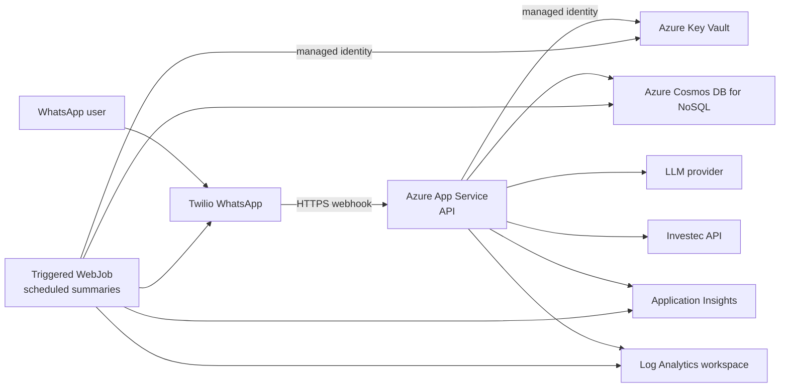

# Infrastructure Design

## Status and purpose

This document defines the proposed Azure App Service infrastructure for the
MVP. No infrastructure-as-code or Azure resources are currently present in
this repository; the `infrastructure/` directory is empty at the time of
writing.

The design supports a small WhatsApp-based personal-finance agent while
keeping operations, secrets, and customer data appropriately separated. It is
not a production deployment runbook and does not claim that the listed
resources have been provisioned.

## Design principles

- Use managed Azure services before operating infrastructure ourselves.
- Keep the public surface area to one HTTPS webhook API.
- Separate the always-on webhook API from finite scheduled work.
- Keep secrets in Key Vault; source code, images, and deployment manifests must
  not contain credentials.
- Prefer managed identities for Azure-to-Azure access.
- Make telemetry available without recording customer financial data.
- Provision resources reproducibly with Bicep committed under
  `infrastructure/` when implementation begins.

## Proposed MVP topology



## Resource inventory

| Resource | MVP role | Initial configuration |
| --- | --- | --- |
| Resource group | Lifecycle boundary for one environment | One resource group per environment. |
| App Service plan | Compute and scaling boundary | Linux plan sized for the Node.js API and its WebJobs; production SKU determined before live traffic. |
| App Service web app: API | Receives Twilio webhooks and serves health endpoints | Node.js Linux runtime; HTTPS only; managed identity; App Service Health Check on `/health`. |
| Triggered WebJob | Runs daily/weekly/monthly summaries and alerts | A scheduled Node.js job deployed with the web app; Always On enabled; bounded execution and idempotent delivery. |
| Cosmos DB for NoSQL account | Stores sessions, memory, goals, transaction snapshots, schedules, and audit records | Separate database/container definitions decided alongside the repository implementation. |
| Key Vault | Stores third-party credentials and connection strings | RBAC authorization; no direct secret values in deployment files. |
| Application Insights | Application telemetry destination | Uses the minimal observability design in `02_observability-minimal-start.md`. |
| Log Analytics workspace | App Service and Application Insights log query/store | Retention and access policy set per environment. |

The LLM provider and Investec remain external dependencies. Twilio is both an
external dependency and the public webhook caller; it is not deployed into the
Azure resource group.

## Workload design

### Webhook API

The API is a long-running Linux Azure App Service web app. It exposes only:

- `POST /webhooks/twilio`
- `GET /health`
- `GET /ping`

Twilio calls the webhook through the App Service HTTPS hostname or a
future custom domain. The app must validate Twilio's request signature before
processing a webhook. The production App Service plan must have at least one
instance and use Always On so the webhook endpoint and scheduled work are not
suspended. The instance count and autoscale limits must be set deliberately
after expected traffic and downstream rate limits are known.

`/health` is the App Service Health Check endpoint and must not call external
providers. It may verify local process health only. Deep dependency checks
belong in a separately designed operational check so an Investec or LLM outage
does not repeatedly remove healthy instances from service.

### Scheduled summaries

Scheduled summaries are triggered WebJobs, rather than timers in the API
process. Each execution is finite and observable. WebJobs run under the same
App Service plan as the API, so they are an MVP convenience rather than a
separate scaling or isolation boundary. Always On is required for reliable
scheduled execution. The job startup path and schedule are explicit and
testable.

The WebJob scheduler uses a six-field NCRONTAB schedule. Any user-facing
schedule must be converted from the user's intended time zone and stored with
the time-zone information. The job must be idempotent: a retry or duplicated
execution must not send the same WhatsApp notification twice.

## Identity, secrets, and configuration

The App Service web app receives a managed identity. It has only the roles it
requires:

- `Key Vault Secrets User` on the Key Vault to read referenced secrets.
- A least-privilege Cosmos DB data-plane role once the repository access model
  is implemented.

Store these values in Key Vault:

- Twilio account credentials, auth token, and webhook validation secret.
- Investec credentials and any token/refresh-token material.
- OpenAI or other LLM provider API key.
- Cosmos DB connection material if managed-identity access is not available for
  the selected client path.
- `APPLICATIONINSIGHTS_CONNECTION_STRING`.

Non-secret configuration is supplied as environment variables and defined in
infrastructure code, for example `NODE_ENV`, service name, provider base URLs,
feature flags, and schedule definitions. `.env` files are local-development
only and are never deployed or committed.

## Data and network posture

The initial topology allows outbound HTTPS calls from the API/WebJob to Twilio,
the LLM provider, and Investec. Public network access for Cosmos DB and Key
Vault is an explicit temporary MVP decision, protected by identity, firewall
rules, and secretless application access where possible.

Before real customer financial data is onboarded, review and decide:

- Private endpoints for Cosmos DB and Key Vault.
- App Service virtual-network integration and private DNS requirements.
- Egress control and private DNS requirements.
- Regional data residency, backup, retention, and disaster recovery needs.
- Azure RBAC groups for operators, developers, and read-only telemetry users.

The public API must require HTTPS. It accepts traffic only through the Twilio
webhook route; route-level request-size limits, signature verification, and
rate/abuse protection will be configured in the API/application design.

## Observability and operations

Application telemetry follows
[Minimal Observability Starting Point](02_observability-minimal-start.md):

- Application Insights receives automatically collected requests,
  dependencies, exceptions, and safe structured logs.
- App Service diagnostic logs are sent to the Log Analytics workspace.
- No prompts, WhatsApp bodies, telephone numbers, transaction data, secrets,
  or provider request/response bodies are emitted to telemetry.

Initial operational alerts should cover:

- API availability and a sustained rise in webhook HTTP failures.
- Job execution failures or missed expected job runs.
- Cosmos DB, LLM, Investec, or Twilio dependency failure-rate spikes.
- Telemetry ingestion approaching the configured daily cap.

Alert recipients, severity, and on-call process remain a product/operations
decision and are not yet defined.

## Environments and naming

Use isolated `dev`, `test`, and `prod` environments. No production secret,
database, Application Insights resource, or Twilio credential is shared with
non-production.

Use a consistent name pattern such as:

```text
tjabane-<environment>-<resource>
```

Examples: `tjabane-dev-api`, `tjabane-prod-cosmos`, and
`tjabane-prod-kv`. The final Azure region, subscription structure, and naming
constraints must be recorded in deployment parameters rather than application
code.

## Infrastructure-as-code and deployment

Bicep is the proposed infrastructure-as-code format because the solution is
Azure-native. The future directory layout is:

```text
infrastructure/
  main.bicep
  modules/
    app-service-plan.bicep
    web-app.bicep
    web-jobs.bicep
    cosmos.bicep
    key-vault.bicep
    monitoring.bicep
  parameters/
    dev.bicepparam
    test.bicepparam
    prod.bicepparam
```

Provisioning creates Azure resources and role assignments but never creates or
stores third-party secret values in source control. Secret values are set
through a secured deployment process after Key Vault exists.

A later CI/CD design should:

1. Run formatting, linting, tests, and image build.
2. Package the Node.js application and WebJob artifact from a committed build.
3. Run Bicep validation/what-if for the target environment.
4. Deploy infrastructure and update the App Service application artifact.
5. Run a smoke test against `/health` and a non-financial webhook test.

Production deployment approvals, rollback retention, and image vulnerability
scanning are still open decisions.

## Implementation order

1. Create Bicep for the resource group dependencies: Log Analytics,
   Application Insights, Key Vault, and the App Service plan/web app.
2. Deploy the Node.js API with an App Service Health Check on `/health` and no third-party
   credentials.
3. Add Key Vault references, managed identity, and Twilio webhook signature
   validation.
4. Add Cosmos DB and the repository deployment configuration.
5. Add the telemetry bootstrap described in the observability specification.
6. Add triggered scheduled WebJobs only when proactive summaries are
   implemented.
7. Perform the private-network and production-security review before handling
   live financial data.

## References

- [Azure App Service scheduled WebJobs](https://learn.microsoft.com/en-us/azure/app-service/tutorial-webjobs)
- [Azure App Service health check and settings](https://learn.microsoft.com/en-us/azure/app-service/reference-app-settings)
- [Azure App Service scaling](https://learn.microsoft.com/en-us/azure/app-service/manage-automatic-scaling)
- [Azure App Service deployment slots](https://learn.microsoft.com/en-us/azure/app-service/deploy-staging-slots)
