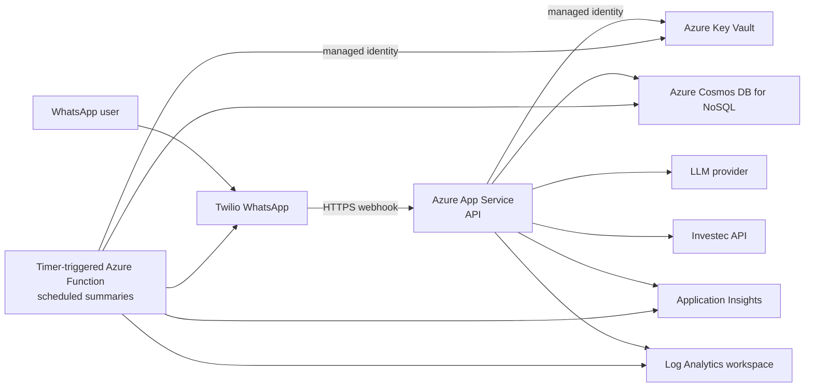

# Infrastructure Design

## Status and purpose

This document defines the Azure infrastructure for the MVP. The implemented
infrastructure-as-code is in `infrastructure/`. It provisions the shared
platform resources, identity, and role assignments described below. Database
and container definitions, diagnostic settings, alerts, autoscale rules, and
the scheduled-function resource and artifact are not implemented yet.

The design supports a small WhatsApp-based personal-finance agent while
keeping operations, secrets, and customer data appropriately separated. The
development resources were deployed on 24 July 2026. This document is not a
production deployment runbook and does not claim that production resources
have been provisioned.

## Design principles

- Use managed Azure services before operating infrastructure ourselves.
- Keep the public surface area to one HTTPS webhook API.
- Separate the request-driven webhook API from finite scheduled work.
- Keep secrets in Key Vault; source code, images, and deployment manifests must
  not contain credentials.
- Prefer managed identities for Azure-to-Azure access.
- Make telemetry available without recording customer financial data.
- Provision resources reproducibly with Bicep committed under
  `infrastructure/`.

## Proposed MVP topology



## Azure resource mapping

| System component                                                             | Azure resource                       | Why this resource is used                                                                                                                               | Implemented configuration                                                                                                                                                                                                             |
| ---------------------------------------------------------------------------- | ------------------------------------ | ------------------------------------------------------------------------------------------------------------------------------------------------------- | ------------------------------------------------------------------------------------------------------------------------------------------------------------------------------------------------------------------------------------- |
| Environment boundary                                                         | Resource group                       | Gives each environment an independent lifecycle, access-control scope, cost boundary, and deployment target.                                            | One resource group per environment, created by `subscription.bicep`. A resource group has no SKU.                                                                                                                                     |
| Webhook API                                                                  | Linux Azure App Service web app      | Hosts the Node.js/Express Twilio webhook without requiring VM management. `F1` avoids a standing compute charge for this private, single-user workload. | HTTPS only on the default `azurewebsites.net` hostname, HTTP/2, TLS 1.2 minimum, FTP disabled, `/health` health check, and client affinity disabled. Always On is disabled and the app may cold-start after being idle.               |
| API compute                                                                  | Azure App Service plan               | Supplies the shared Linux worker and runtime boundary for the webhook API.                                                                              | `F1` Free, one shared worker, no scale-out, no SLA, 60 CPU-minutes/day, 1 GB storage, and no custom domain.                                                                                                                           |
| Scheduled summaries and alerts                                               | Azure Functions Flex Consumption     | Timer triggers wake only for scheduled work and scale back to zero, avoiding the Always On requirement and fixed App Service cost.                      | Planned `FC1` with zero always-ready instances. It is not provisioned yet. Its storage account and usage above the monthly on-demand grant are separately billable.                                                                   |
| Sessions, memory, goals, transaction snapshots, schedules, and audit records | Serverless Azure Cosmos DB for NoSQL | Fits the JSON document model and charges this intermittent single-user workload for consumed request units rather than continuously provisioned RU/s.   | `EnableServerless`, one region, Session consistency, local-key authentication disabled, and no zone redundancy. Database, containers, and partition keys are not declared yet. No throughput value is used for serverless containers. |
| Third-party credentials                                                      | Azure Key Vault                      | Keeps Twilio, Investec, and LLM credentials out of source and application configuration while allowing identity-based reads.                            | Standard SKU, Azure RBAC authorization, soft delete, and production-only purge protection.                                                                                                                                            |
| Azure-to-Azure authentication                                                | System-assigned managed identity     | Removes stored Azure credentials and ties access to the web app lifecycle.                                                                              | Assigned to the web app with Key Vault Secrets User and Cosmos DB Built-in Data Contributor roles. Managed identity has no SKU.                                                                                                       |
| Application performance and distributed telemetry                            | Workspace-based Application Insights | Captures requests, dependencies, exceptions, and safe structured application/agent telemetry.                                                           | Workspace-based resource using Log Analytics ingestion. Application Insights has no independently selected SKU in this design.                                                                                                        |
| Telemetry storage and queries                                                | Log Analytics workspace              | Provides the storage, retention, and KQL query boundary behind Application Insights and future App Service diagnostic logs.                             | `PerGB2018` pay-as-you-go SKU with 30-day workspace retention.                                                                                                                                                                        |

The LLM provider and Investec remain external dependencies. Twilio is both an
external dependency and the public webhook caller; it is not deployed into the
Azure resource group.

## Development and production SKU baseline

The table below is the source-controlled baseline, not a claim about resources
already deployed in an Azure subscription. Prices are deliberately excluded
because they vary by region, currency, negotiated agreement, and usage.

| Resource                                               | Development                                                 | Production                                                  | Reason for the selection                                                                                                                                                                                            |
| ------------------------------------------------------ | ----------------------------------------------------------- | ----------------------------------------------------------- | ------------------------------------------------------------------------------------------------------------------------------------------------------------------------------------------------------------------- |
| App Service plan                                       | `F1` / `Free`, one shared worker                            | `F1` / `Free`, one shared worker                            | There is no App Service compute charge. The limits are acceptable only because the service is private and used by one person. There is no SLA or Always On, so cold starts and quota exhaustion are accepted risks. |
| App Service web app                                    | Included in App Service plan                                | Included in App Service plan                                | App Service web apps do not have a separate SKU.                                                                                                                                                                    |
| Scheduled functions                                    | Planned `FC1` Flex Consumption; zero always-ready instances | Planned `FC1` Flex Consumption; zero always-ready instances | On-demand functions scale to zero and include a monthly grant of 250,000 executions and 100,000 GB-s. A storage account is billed separately.                                                                       |
| Cosmos DB for NoSQL account                            | Serverless; usage-based RUs and storage                     | Serverless; usage-based RUs and storage                     | `EnableServerless` avoids a provisioned-throughput minimum. Development and production costs vary with consumed request units, storage, and network egress.                                                         |
| Key Vault                                              | `Standard`                                                  | `Standard`                                                  | The application stores and retrieves secrets but does not require Premium HSM-protected keys.                                                                                                                       |
| Log Analytics workspace                                | `PerGB2018` pay-as-you-go; 30-day retention                 | `PerGB2018` pay-as-you-go; 30-day retention                 | Pay-as-you-go avoids a fixed ingestion commitment while telemetry volume is small or unknown. Reassess a commitment tier only after measured production ingestion justifies it.                                     |
| Application Insights                                   | Workspace-based; billed through Log Analytics               | Workspace-based; billed through Log Analytics               | The associated Log Analytics workspace determines the telemetry pricing plan.                                                                                                                                       |
| Resource group, managed identity, and RBAC assignments | No SKU                                                      | No SKU                                                      | These are Azure management and identity resources, not separately sized compute/data services.                                                                                                                      |

The development profile is declared in
`infrastructure/parameters/dev.bicepparam`; the production profile is declared
in `infrastructure/parameters/prod.bicepparam`. The subscription template
derives a stable globally unique resource suffix from the subscription ID and
resource-group name. This keeps repeated deployments idempotent without
requiring an operator-maintained suffix.

## Running cost estimate

This estimate is for the private, single-user application. Prices and the
exchange rate were reviewed on 24 July 2026. It is a planning estimate, not an
Azure or third-party quote.

The expected all-in cost is approximately **USD 2-10 per month**, or roughly
**ZAR 35-170 per month**, before VAT and Meta charges for proactive WhatsApp
template messages.

| Component                              | Monthly estimate | Assumption                                                                                                      |
| -------------------------------------- | ---------------: | --------------------------------------------------------------------------------------------------------------- |
| Linux App Service `F1`                 |            $0.00 | One Free-tier shared worker.                                                                                    |
| Serverless Cosmos DB                   |      $0.10-$1.00 | Intermittent single-user traffic, approximately up to 2 million consumed RUs and about 1 GB stored.             |
| Application Insights and Log Analytics |            $0.00 | Monthly pay-as-you-go ingestion remains within the first 5 GB free allowance.                                   |
| Key Vault Standard                     |           <$0.01 | A small number of secret reads; Standard secret operations are charged per 10,000 operations.                   |
| Azure Functions Flex Consumption       |      $0.00-$0.50 | Scheduled work remains within the on-demand monthly grant; the associated storage account may cost a few cents. |
| Network transfer                       |      About $0.00 | One user's small JSON requests and responses produce negligible billable egress.                                |
| Twilio WhatsApp                        |      $1.50-$3.00 | Approximately 300-600 total inbound and outbound messages at $0.005 per message.                                |
| LLM provider                           |      $0.50-$5.00 | Light single-user use of a cost-efficient text model; actual prompt history and output size determine cost.     |
| **Expected total**                     |       **$2-$10** | Excludes VAT, foreign-exchange charges, paid support, and Meta template-message fees.                           |

The rand estimate uses an indicative exchange rate of approximately
**USD 1 = ZAR 16.80**. Azure uses its own monthly currency-conversion rules, so
the invoice will not exactly match the spot-rate conversion.

### Cosmos DB serverless estimate

South Africa North retail rates reviewed for this estimate are:

- **$0.335 per 1 million consumed request units**
- **$0.365 per GB of transactional storage per month**

| Usage                   | Request-unit cost | Storage cost | Cosmos total |
| ----------------------- | ----------------: | -----------: | -----------: |
| 100,000 RU and 0.1 GB   |             $0.03 |        $0.04 |        $0.07 |
| 1 million RU and 1 GB   |             $0.34 |        $0.37 |        $0.70 |
| 10 million RU and 1 GB  |             $3.35 |        $0.37 |        $3.72 |
| 100 million RU and 1 GB |            $33.50 |        $0.37 |       $33.87 |

Serverless has no minimum RU/s charge. It is not eligible for the Cosmos DB
provisioned-throughput Free Tier, but that trade-off avoids reserving capacity
and suits intermittent single-user traffic. Database and container
declarations must not specify throughput when used with this account.

### First-month cost review

Keep App Service on `F1` for the first month. At the end of the month, review:

- App Service CPU quota consumption, cold starts, HTTP failures, and Twilio
  webhook response time.
- Cosmos DB consumed RUs, throttled requests, query efficiency, and stored data.
- Application Insights and Log Analytics ingestion volume.
- Function executions, execution GB-seconds, and storage transactions.
- Twilio inbound, outbound, and paid template-message counts.
- LLM input, cached-input, reasoning, and output tokens by model.
- The Azure invoice, Twilio invoice, and LLM provider invoice.

Do not move to a paid App Service tier based only on elapsed time. Scale up
only if measured CPU quota exhaustion, cold-start latency, reliability, or a
required feature justifies the recurring cost.

### Capacity decisions still required

- Define Cosmos DB databases, containers, and partition keys without specifying
  throughput. All containers in a serverless account are serverless.
- Provision the Flex Consumption function app and storage account, then move
  scheduled summaries and alerts to timer-triggered functions.
- Measure App Service CPU quota consumption and Twilio webhook response time.
  Move away from `F1` only if the 60 CPU-minute daily quota or cold starts make
  the single-user experience unreliable.
- Configure telemetry sampling, a daily ingestion cap, diagnostic settings,
  and alerts before enabling production traffic.
- Review private endpoints, VNet integration, and public network access before
  storing real customer financial data.

## Workload design

### Webhook API

The API is a long-running Linux Azure App Service web app. It exposes only:

- `POST /webhooks/twilio`
- `GET /health`
- `GET /ping`

Twilio calls the webhook through the default App Service HTTPS hostname. The
Free tier does not support a custom domain. The app must validate Twilio's
request signature before processing a webhook.

The `F1` worker is allowed to unload after an idle period. A cold start is an
accepted cost trade-off for this single-user application, but webhook latency
must be measured against Twilio's timeout behaviour. The Free tier also has a
60 CPU-minute daily quota and no financially backed SLA. If measurements show
that either constraint makes the service unreliable, the next decision is a
consumption-based host or a paid App Service tier; it is not a reason to
pre-provision Premium capacity.

`/health` is the App Service Health Check endpoint and must not call external
providers. It may verify local process health only. Deep dependency checks
belong in a separately designed operational check so an Investec or LLM outage
does not repeatedly remove healthy instances from service.

### Scheduled summaries

Scheduled summaries use timer-triggered Azure Functions on Flex Consumption,
rather than timers in the API process or App Service WebJobs. `F1` has no
Always On, so an in-process timer or scheduled WebJob would not be reliable.
Each function execution is finite, observable, and can scale back to zero.

The timer trigger uses a CRON schedule. Any user-facing schedule must be
converted from the user's intended time zone and stored with the time-zone
information. The function must be idempotent: a retry or duplicated execution
must not send the same WhatsApp notification twice.

## Identity, secrets, and configuration

The App Service web app receives a managed identity. It has only the roles it
requires:

- `Key Vault Secrets User` on the Key Vault to read referenced secrets.
- A least-privilege Cosmos DB data-plane role once the repository access model
  is implemented.

The scheduled Function App will receive its own managed identity and equivalent
least-privilege access when that resource is implemented. It will not reuse
credentials belonging to the webhook app.

Store these values in Key Vault:

- Twilio account credentials, auth token, and webhook validation secret.
- Investec credentials and any token/refresh-token material.
- OpenAI or other LLM provider API key.
- Cosmos DB connection material if managed-identity access is not available for
  the selected client path.
- `APPLICATIONINSIGHTS_CONNECTION_STRING`.

Non-secret configuration is supplied as environment variables and defined in
infrastructure code, for example `NODE_ENV`, service name, provider base URLs,
feature flags, and schedule definitions. `.env` files are local-development
only and are never deployed or committed.

## Data and network posture

The initial topology allows outbound HTTPS calls from the API and scheduled
functions to Twilio, the LLM provider, and Investec. Public network access for
Cosmos DB and Key Vault is an explicit temporary MVP decision, protected by
identity, firewall rules, and secretless application access where possible.

Before real customer financial data is onboarded, review and decide:

- Private endpoints for Cosmos DB and Key Vault.
- App Service virtual-network integration and private DNS requirements.
- Egress control and private DNS requirements.
- Regional data residency, backup, retention, and disaster recovery needs.
- Azure RBAC groups for operators, developers, and read-only telemetry users.

The public API must require HTTPS. It accepts traffic only through the Twilio
webhook route; route-level request-size limits, signature verification, and
rate/abuse protection will be configured in the API/application design.

## Observability and operations

Application telemetry follows
[Minimal Observability Starting Point](02_observability-minimal-start.md):

- Application Insights receives automatically collected requests,
  dependencies, exceptions, and safe structured logs.
- App Service diagnostic logs are sent to the Log Analytics workspace.
- No prompts, WhatsApp bodies, telephone numbers, transaction data, secrets,
  or provider request/response bodies are emitted to telemetry.

Initial operational alerts should cover:

- API availability and a sustained rise in webhook HTTP failures.
- Job execution failures or missed expected job runs.
- Cosmos DB, LLM, Investec, or Twilio dependency failure-rate spikes.
- Telemetry ingestion approaching the configured daily cap.

Alert recipients, severity, and on-call process remain a product/operations
decision and are not yet defined.

## Environments and naming

Use isolated `dev`, `test`, and `prod` environments. No production secret,
database, Application Insights resource, or Twilio credential is shared with
non-production.

Use a consistent name pattern such as:

```text
tjabane-<environment>-<resource>
```

Examples: `tjabane-dev-api`, `tjabane-prod-cosmos`, and
`tjabane-prod-kv`. The final Azure region, subscription structure, and naming
constraints must be recorded in deployment parameters rather than application
code.

## Infrastructure-as-code and deployment

Bicep is the infrastructure-as-code format because the solution is
Azure-native. The current directory layout is:

```text
infrastructure/
  main.bicep
  subscription.bicep
  parameters/
    dev.bicepparam
    prod.bicepparam
```

A `test.bicepparam` profile and service-specific Bicep modules may be added
when the infrastructure grows enough to justify them.

Provisioning creates Azure resources and role assignments but never creates or
stores third-party secret values in source control. Secret values are set
through a secured deployment process after Key Vault exists.

A later CI/CD design should:

1. Run formatting, linting, tests, and image build.
2. Package the Node.js API and scheduled-function artifacts from a committed
   build.
3. Run Bicep validation/what-if for the target environment.
4. Deploy infrastructure and update the App Service application artifact.
5. Run a smoke test against `/health` and a non-financial webhook test.

Production deployment approvals, rollback retention, and image vulnerability
scanning are still open decisions.

## Implementation order

1. Create Bicep for the resource group dependencies: Log Analytics,
   Application Insights, Key Vault, and the App Service plan/web app.
2. Deploy the Node.js API with an App Service Health Check on `/health` and no third-party
   credentials.
3. Add Key Vault references, managed identity, and Twilio webhook signature
   validation.
4. Add Cosmos DB and the repository deployment configuration.
5. Add the telemetry bootstrap described in the observability specification.
6. Add timer-triggered Flex Consumption functions when proactive summaries are
   implemented.
7. Perform the private-network and production-security review before handling
   live financial data.

## References

- [Azure App Service plans and pricing tiers](https://learn.microsoft.com/en-us/azure/app-service/overview-hosting-plans)
- [Azure App Service limits](https://learn.microsoft.com/en-us/azure/azure-resource-manager/management/azure-subscription-service-limits#azure-app-service-limits)
- [Azure App Service health check and settings](https://learn.microsoft.com/en-us/azure/app-service/reference-app-settings)
- [Azure Functions Flex Consumption](https://learn.microsoft.com/en-us/azure/azure-functions/flex-consumption-plan)
- [Run scheduled tasks using Azure Functions](https://learn.microsoft.com/en-us/azure/azure-functions/scenario-scheduled-tasks)
- [Azure Cosmos DB serverless account type](https://learn.microsoft.com/en-us/azure/cosmos-db/serverless)
- [Choose Cosmos DB manual or autoscale provisioned throughput](https://learn.microsoft.com/en-us/azure/cosmos-db/how-to-choose-offer)
- [Azure Key Vault key types and protection](https://learn.microsoft.com/en-us/azure/key-vault/keys/about-keys)
- [Configure workspace-based Application Insights pricing](https://learn.microsoft.com/en-us/azure/azure-monitor/app/create-workspace-resource)
- [Azure App Service for Linux pricing](https://azure.microsoft.com/en-us/pricing/details/app-service/linux/)
- [Azure Cosmos DB serverless pricing](https://azure.microsoft.com/en-us/pricing/details/cosmos-db/serverless/)
- [Azure Monitor pricing](https://azure.microsoft.com/en-us/pricing/details/monitor/)
- [Azure Functions pricing](https://azure.microsoft.com/en-us/pricing/details/functions/)
- [Azure Key Vault pricing](https://azure.microsoft.com/en-us/pricing/details/key-vault/)
- [Twilio WhatsApp pricing](https://www.twilio.com/en-us/whatsapp/pricing)
- [OpenAI API model pricing](https://developers.openai.com/api/docs/models)
- [USD/ZAR reference rate](https://tradingeconomics.com/south-africa/currency)
