# Agent-to-API Integration Design

## Status and purpose

This document proposes how the agent module should be integrated into the
Express API and Twilio WhatsApp webhook. It builds on the existing agent loop,
repository, service, tool-registry, observability, and infrastructure designs.

The first delivery target is a synchronous MVP on the existing Azure App
Service. The boundaries deliberately allow the webhook to move to durable,
asynchronous processing later without changing the agent loop.

## Current state

The repository already contains most of the inner application flow:

- `ConversationOrchestrator` loads a session, creates an agent, sends one user
  message, and saves the updated history.
- `DefaultAgentFactory` injects a model client, tool registry, and agent
  configuration into each task-scoped agent.
- `SessionRepository` persists sessions through a provider-neutral database
  client and includes a `findByUserId` query.
- The services module contains HTTP and Investec adapters.
- The API exposes `POST /webhooks/twilio`, but its handler currently logs the
  incoming values and returns a fixed acknowledgement.

The missing integration pieces are an API composition root, a production
`ModelClient`, a concrete tool registry, sender and session resolution,
session creation, Twilio validation, idempotency, concurrency protection, and
safe failure-to-JSON mapping.

## Design goals

- Keep Twilio and Express types outside the agent module.
- Keep model-provider SDK types outside the agent loop.
- Construct infrastructure dependencies once at process startup.
- Pass authenticated identity into tools as trusted execution context.
- Treat webhook fields and model tool arguments as untrusted input.
- Process a Twilio `MessageSid` no more than once.
- Avoid lost conversation history when messages overlap.
- Never log message bodies, telephone numbers, prompts, responses, account
  data, or credentials.
- Preserve a small synchronous MVP with an explicit path to durable
  asynchronous processing.

## Proposed component architecture

The API is the composition root. The handler depends on one application-level
capability and does not construct concrete model, database, banking, or tool
implementations.

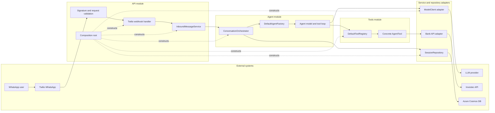

## Module ownership and dependency direction

| Module     | Owns                                                                                                 | Must not own                                                   |
| ---------- | ---------------------------------------------------------------------------------------------------- | -------------------------------------------------------------- |
| API        | Express, Twilio parsing and verification, configuration, dependency construction, HTTP error mapping | Agent loop, provider response mapping, banking calculations    |
| Agent      | Conversation orchestration, model/tool loop, provider-neutral contracts                              | Express, Twilio, Cosmos, LLM-provider, or Investec SDK details |
| Tools      | Approved definitions, argument validation, dispatch, model-safe results                              | Webhooks, session lifecycle, raw provider responses            |
| Services   | Model and banking provider adapters, outbound HTTP behavior                                          | Express handlers, conversation history ownership               |
| Repository | Persistence adapters and database mapping                                                            | Agent execution, Twilio identity policy                        |

Dependencies point inward toward stable application contracts:

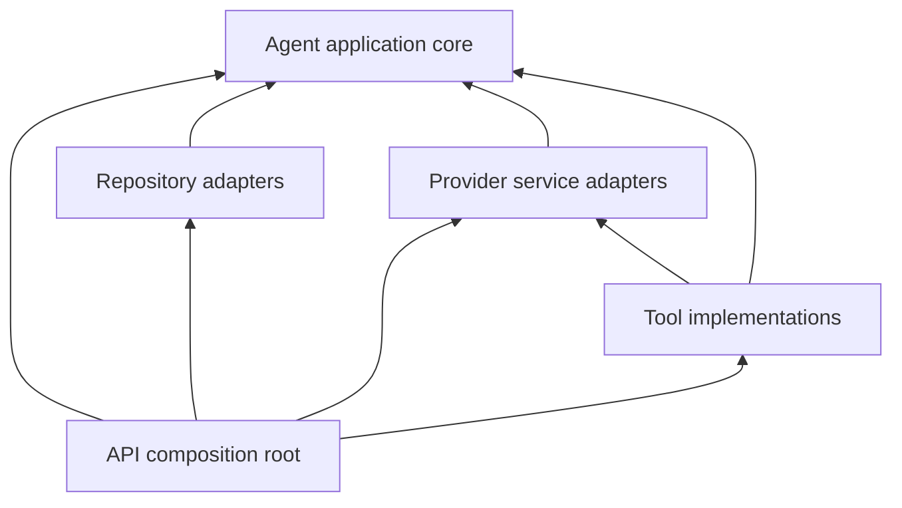

Concrete infrastructure packages may depend on application-owned interfaces.
The agent must not depend on concrete infrastructure packages. If session and
conversation types are required by multiple modules, either the repository
implements the agent-owned port directly or genuinely shared types move to a
small contracts package. Independently maintained copies should be avoided.

## API composition root

Create `src/composition/create-application.ts` in the API package. It constructs
the dependency graph once during process startup.

```mermaid
flowchart TD
    Config[Validated AppConfig]
    CosmosSdk[Cosmos SDK client]
    DbClient[CosmosDatabaseClient]
    Sessions[SessionRepository]
    Http[FetchHttpClient]
    BankAuth[Investec token provider]
    BankClient[InvestecBankApiClient]
    ModelClient[Provider ModelClient]
    ConcreteTools[Concrete tools]
    Registry[DefaultToolRegistry]
    Factory[DefaultAgentFactory]
    Orchestrator[ConversationOrchestrator]
    Identity[UserIdentityResolver]
    Inbox[InboundMessageRepository]
    Inbound[DefaultInboundMessageService]
    Handler[Twilio webhook handler]
    App[Express application]

    Config --> CosmosSdk --> DbClient --> Sessions
    Config --> Http
    Config --> BankAuth --> BankClient
    Http --> BankAuth
    Http --> BankClient
    Config --> ModelClient
    BankClient --> ConcreteTools --> Registry
    ModelClient --> Factory
    Registry --> Factory
    Sessions --> Orchestrator
    Factory --> Orchestrator
    Identity --> Inbound
    Inbox --> Inbound
    Orchestrator --> Inbound --> Handler --> App
```

Suggested construction contracts:

```ts
export interface AppDependencies {
  readonly twilioWebhookHandler: RequestHandler;
}

export function createApp(dependencies: AppDependencies): Express;

export interface Application {
  readonly app: Express;
  readonly dispose: () => Promise<void>;
}

export function createApplication(config: AppConfig): Application;
```

`server.ts` loads telemetry first, validates configuration, creates the
application, and starts listening. Tests can call `createApp` with a fake
handler without constructing Cosmos DB or external clients.

## Inbound message application boundary

The handler translates a channel-specific payload into a provider-neutral
command before invoking application logic.

```ts
export interface InboundMessage {
  readonly channel: "whatsapp";
  readonly providerMessageId: string;
  readonly externalSenderId: string;
  readonly text: string;
}

export interface InboundMessageService {
  handle(message: InboundMessage): Promise<string>;
}
```

`DefaultInboundMessageService` owns idempotency, identity and session
resolution, and orchestration. It does not parse Express requests or generate
transport response JSON.

### Synchronous request sequence

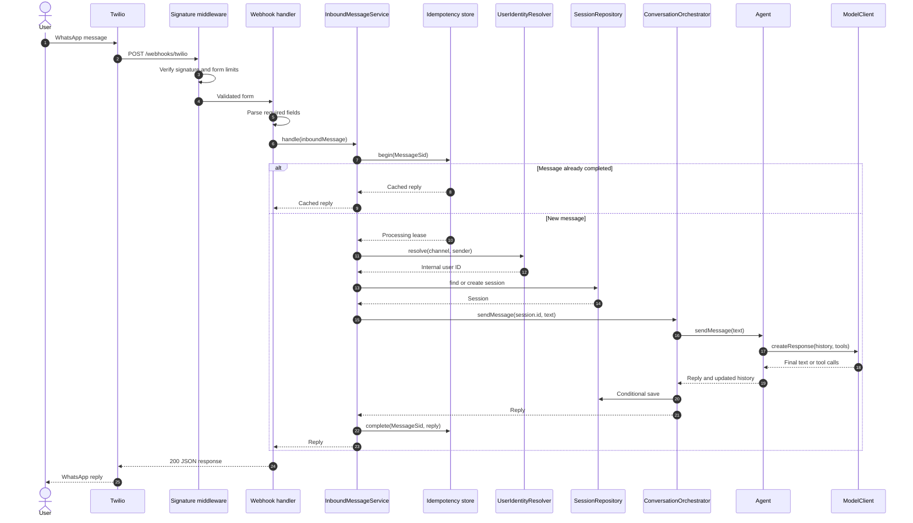

## Identity and session resolution

The Twilio `From` value is an external channel identifier, not an application
user ID. It must not be passed directly into tool execution context or used as
a telemetry attribute.

For the private MVP, an allowlisted sender can map to a configured internal
user ID. The interface should nevertheless support a durable mapping later.

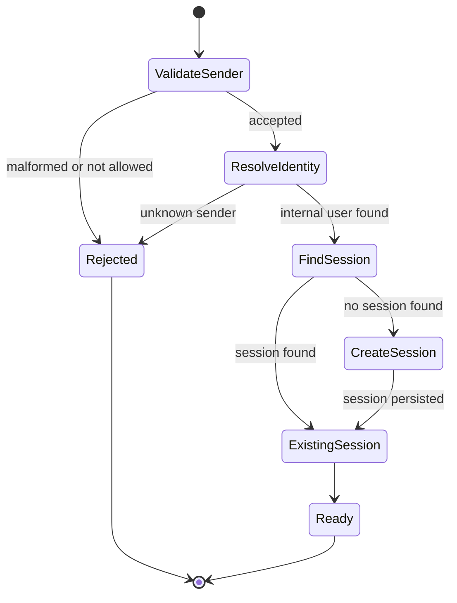

```ts
export interface UserIdentityResolver {
  resolve(channel: "whatsapp", externalSenderId: string): Promise<string | null>;
}

export interface SessionResolver {
  getOrCreateForUser(userId: string): Promise<AgentSession>;
}
```

Session creation assigns an opaque internal ID and initial system or welcome
history according to the onboarding design.

## Idempotency and concurrency

Twilio can retry a webhook. `MessageSid` is the inbound idempotency key. A
duplicate must not call the model, execute tools, or append history twice.

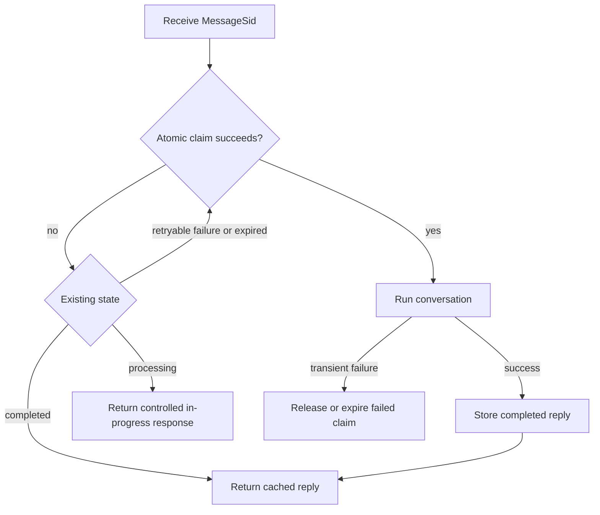

```ts
export interface InboundMessageRecord {
  readonly id: string;
  readonly status: "processing" | "completed" | "failed";
  readonly reply?: string;
  readonly createdAt: string;
  readonly updatedAt: string;
  readonly expiresAt?: number;
}
```

Add an ETag/version to each persisted session and make saves conditional. A
retry of the entire agent run is unsafe when tools can write or call providers.
The preferred policy is to serialize messages per session before invoking the
agent and retain conditional writes as final protection against lost updates.

An in-process keyed mutex can reduce overlap for the single-instance MVP, but
it is not a durable correctness boundary. Cosmos conditional writes or an
equivalent durable lease remain necessary before scale-out.

## Model client adapter

Implement a provider adapter outside the agent core, for example under
`tjabane-agent-tjhelete-services/src/ai/`. It implements the agent-owned
`ModelClient` contract.

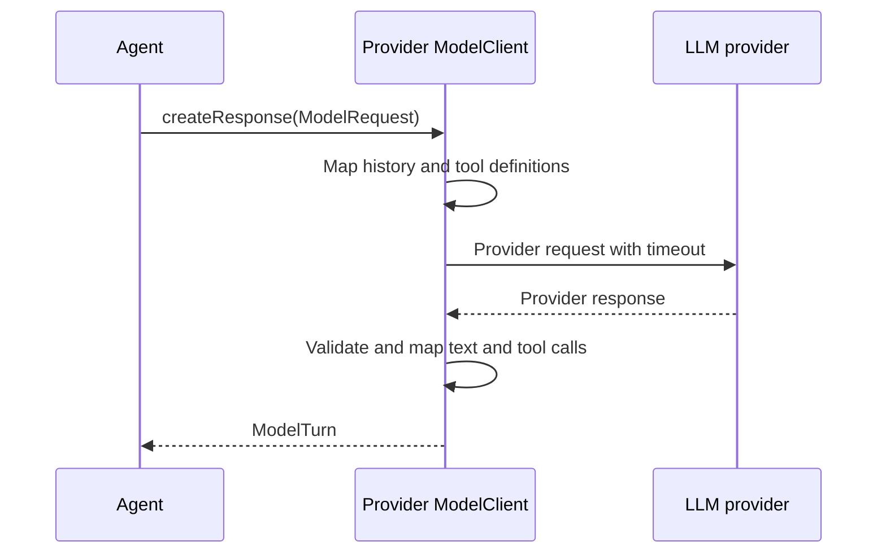

The adapter must:

- translate provider-neutral history into provider input;
- translate `ToolDefinition` into provider tool schemas;
- map provider tool calls into `ModelToolCall`;
- validate provider output before returning it;
- enforce a request timeout;
- retain only safe operational diagnostics;
- never expose prompts, responses, credentials, or financial data in logs;
- expose typed infrastructure failures at the application boundary.

## Tool registry integration

The tools package should implement `AgentTool`, `DefaultToolRegistry`, argument
validation, and the first concrete tools. The API composition root supplies the
complete explicit tool list.

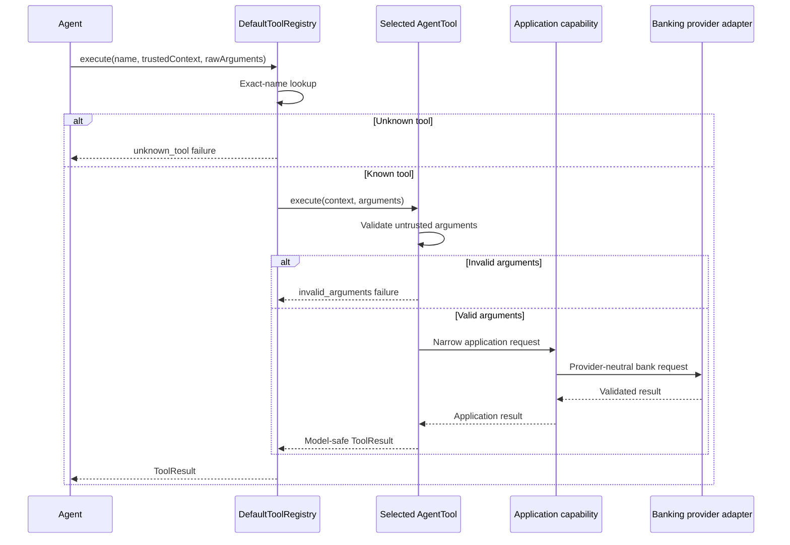

Start with one read-only vertical slice, preferably `list_transactions` or
`get_spending_summary`. This proves the complete webhook-to-provider path
before budget, goal, categorisation, or notification mutations are introduced.

## Twilio HTTP boundary

The route should apply middleware and inject a handler rather than importing a
module-level singleton router.

```ts
export function createTwilioWebhookRouter(
  handler: RequestHandler,
  verifySignature: RequestHandler,
): Router {
  const router = Router();
  router.post("/", verifySignature, handler);
  return router;
}
```

The handler should:

1. Parse `Body`, `From`, `To`, and `MessageSid` from a size-limited URL-encoded
   request.
2. Reject missing or malformed required fields.
3. Translate the fields to `InboundMessage`.
4. Await `InboundMessageService.handle`.
5. Return the reply as `{ "message": "..." }` JSON.
6. Pass unexpected failures to central error middleware.

Twilio signature verification must use the configured public webhook URL and
the original form values. It must run before message processing.

## Error handling policy

External and internal failures should be translated at the nearest boundary
that has enough context to make a safe decision.

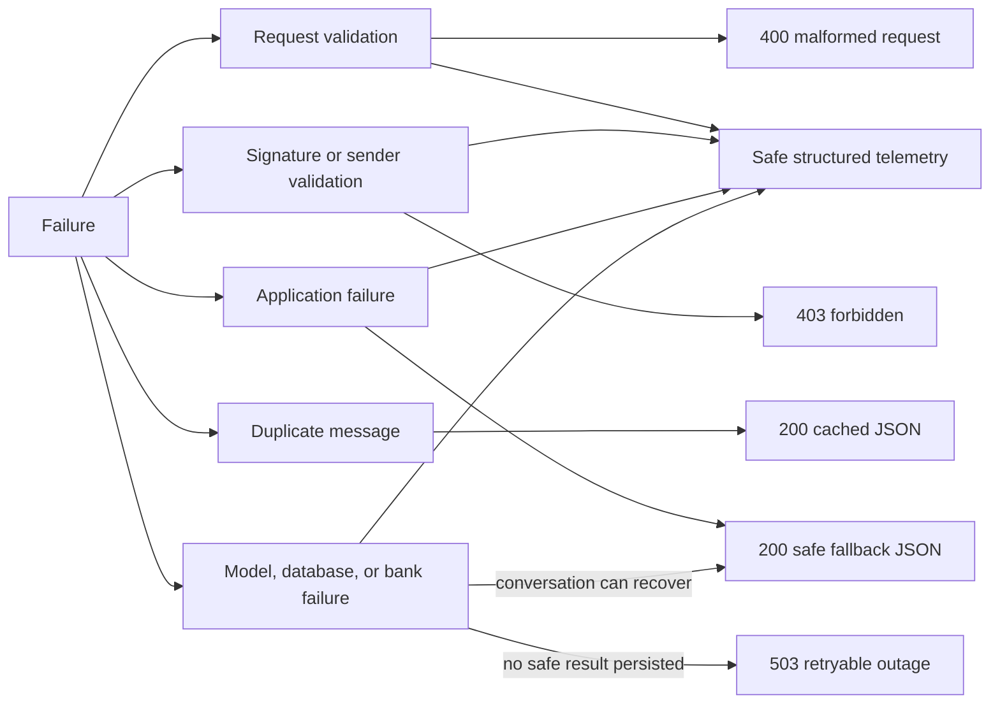

The retry policy must agree with the idempotency state:

- return cached JSON for completed duplicates;
- never expose exception messages, provider bodies, or stack traces;
- return a concise safe reply when the conversation can recover;
- use a retryable HTTP failure only when reprocessing is safe;
- record only low-cardinality operational error types in telemetry.

## Configuration

Expand `AppConfig` with validated, immutable settings for:

- public Twilio webhook URL;
- Twilio auth token or signature-validation secret;
- allowed WhatsApp sender for the private MVP;
- model endpoint, deployment/model name, and credential reference;
- model timeout and overall webhook processing deadline;
- maximum agent tool turns;
- Cosmos endpoint, database name, session container, and inbox container;
- application timezone;
- Investec base URL and credential references.

Configuration parsing should fail startup with a clear setting name when a
required value is missing or malformed. Secrets must come from Key Vault
references or the approved local-development mechanism and must never be
printed.

## Persistence and infrastructure additions

The existing Bicep provisions a Cosmos account but not its SQL database or
containers. Add definitions for at least:

| Resource          | Suggested partition key                                               | Purpose                                     |
| ----------------- | --------------------------------------------------------------------- | ------------------------------------------- |
| `sessions`        | `/id` initially, or `/userId` after redesigning reads around the user | Conversation history and session version    |
| `inboundMessages` | `/id` for direct `MessageSid` lookup                                  | Idempotency state and cached reply          |
| identity mapping  | `/externalIdentifierHash` or a dedicated user partition               | Maps an approved sender to an internal user |

The final partition strategy must align point reads, unique-key needs,
conditional writes, and transactional-batch requirements. Do not require a
cross-partition query for every message without measuring its cost.

## Synchronous MVP and asynchronous evolution

The synchronous design is appropriate for the initial private workload only if
measured end-to-end latency stays safely below Twilio's webhook timeout. Apply
timeouts to each provider call and the overall conversation.

Do not return `200` and continue agent work in an unawaited Express promise.
The App Service process can unload and the work would not be durable.

If latency or reliability requires asynchronous processing, introduce a
durable queue and a separate worker:

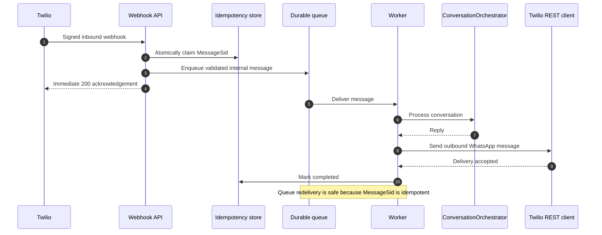

The worker receives an internal command containing opaque user, session, and
message IDs plus the message text. It must not trust or re-parse a raw Twilio
request. This evolution changes delivery orchestration, not the agent, tools,
or service contracts.

## Package dependency changes

The API workspace should declare dependencies on the internal packages it
composes:

```json
{
  "@tjabane-agent-tjhelete/agent": "0.1.0",
  "@tjabane-agent-tjhelete/repository": "0.1.0",
  "@tjabane-agent-tjhelete/services": "0.1.0",
  "@tjabane-agent-tjhelete/tools": "0.1.0"
}
```

The tools and infrastructure packages should depend on the narrow contracts
they implement or consume. Avoid deep imports into another package's `src`
directory; use only public `index.ts` exports.

## Testing strategy

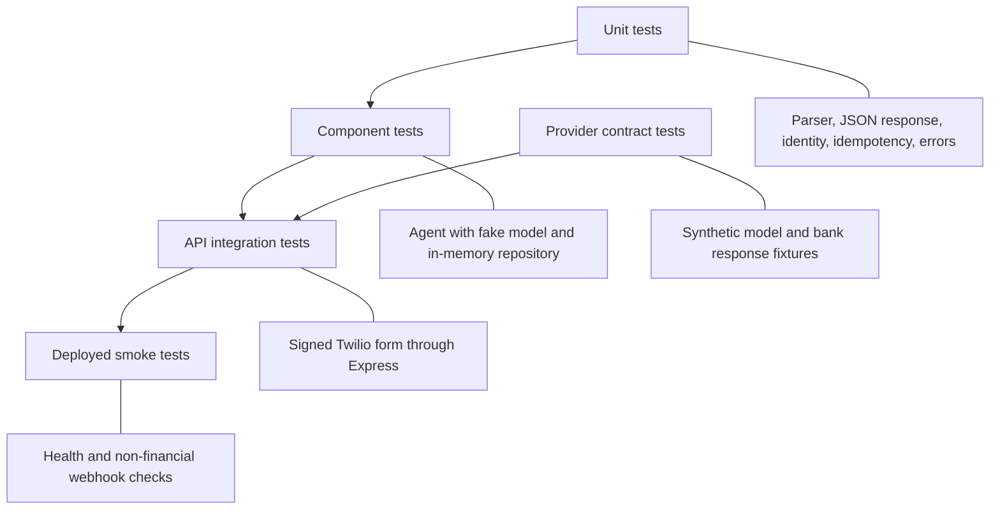

Required test cases include:

- a signed valid webhook returns the model reply as JSON;
- an invalid signature is rejected before application dependencies run;
- missing required form fields are rejected;
- an unknown or disallowed sender cannot create a session;
- a first message creates exactly one session;
- an existing session preserves and extends history;
- a duplicate `MessageSid` returns the cached reply without another model or
  tool call;
- overlapping messages cannot overwrite each other's history;
- model, tool, bank, and Cosmos failures return only safe responses;
- telemetry contains none of the prohibited customer or financial fields.

## Delivery sequence

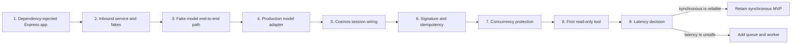

Recommended implementation order:

1. Refactor `createApp` and the Twilio router for dependency injection.
2. Add `InboundMessageService`, identity/session resolution, and fakes.
3. Prove the HTTP-to-agent path with a fake model and no tools.
4. Add the production model adapter.
5. Provision and wire Cosmos resources and session creation.
6. Add signature verification, allowlisting, and `MessageSid` idempotency.
7. Add durable session concurrency control.
8. Implement the registry and one read-only banking tool end to end.
9. Measure latency and decide whether a queue and worker are necessary.

## Acceptance criteria

The initial integration is complete when:

- the API constructs concrete dependencies in one composition root;
- a valid signed webhook reaches the agent and returns its final reply as
  `{ "message": "..." }` JSON;
- the handler depends only on `InboundMessageService`;
- a first-time approved user obtains a persisted session;
- an existing user's history is loaded and conditionally saved;
- duplicate `MessageSid` deliveries do not repeat model or tool execution;
- identity and time enter tools only through trusted execution context;
- at least one read-only tool works through a provider-neutral service;
- provider failures are translated into safe responses;
- prohibited customer, prompt, credential, and financial data is absent from
  logs and telemetry;
- automated tests cover success, invalid signature, duplicate delivery,
  session creation, dependency failure, and concurrent messages.

## Decisions

- Express and Twilio remain transport adapters and do not own agent logic.
- The API is the application composition root.
- Identity resolution and idempotency happen before invoking the agent.
- The agent continues to own the conversation and model/tool loop.
- Model and banking integrations remain provider adapters outside the agent.
- The synchronous MVP is retained initially, subject to measured latency.
- Later asynchronous processing uses a durable queue and separate worker.

## Deferred decisions

- Exact LLM provider and SDK selection.
- Final Cosmos partition and transactional-batch design.
- Whether inbound coordination moves to a dedicated application package after
  a second transport exists.
- Queue and worker technology if asynchronous delivery becomes necessary.
- Conversation-history compaction and retention policy.
- Multi-device or multi-channel identity linking.
